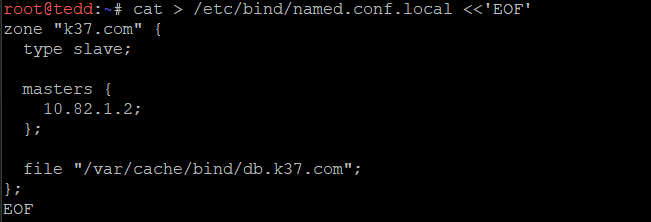
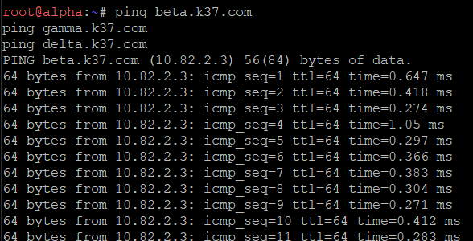
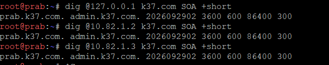
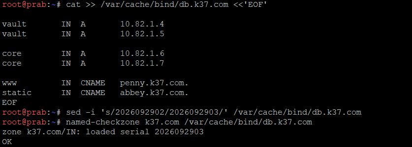
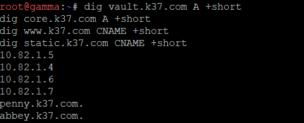
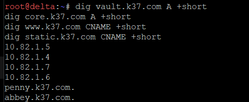
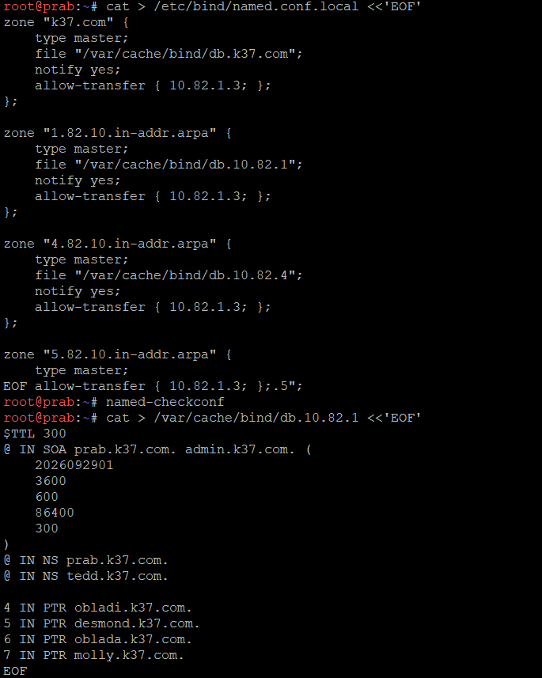
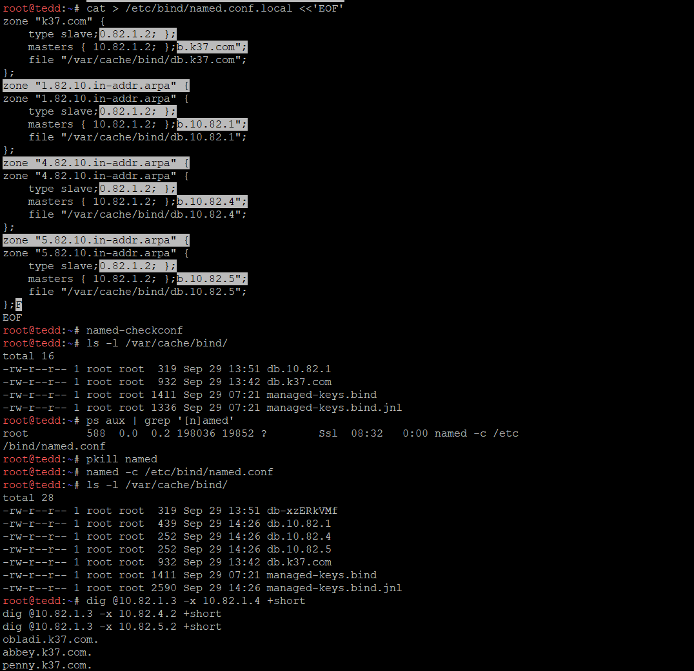

# Jarkom-Modul-2-2026-K-37

Praktikum Jaringan Komputer 2026 - Modul 2 ("The Mesh")

| Nama | NRP |
|---|---|
| Gede Satya Putra Aryanta | 5027251012 |
| Azfaro Zid Ilmi | 5027251018 |


---

## Daftar Isi

- [Informasi Topologi & Pembagian IP](#informasi-topologi--pembagian-ip)
- [Nomor 1](#nomor-1---satya--azfaro)
- [Nomor 2](#nomor-2---satya--azfaro)
- [Nomor 3](#nomor-3---satya--azfaro)
- [Soal No. 4](#soal-no-4)
- [Soal no. 5](#soal-no-5)
- [Soal no. 6](#soal-no-6)
- [soal no. 7](#soal-no-7)
- [soal no.8](#soal-no8)

---


### Tabel Pembagian Interface & Alamat IP

Prefix ip : 10.82.x.x

| Node | Antarmuka | Alamat IP | Netmask | Gateway | Subnet / Keterangan |
|---|---|---|---|---|---|
| rootkit | `eth0`<br>`eth1`<br>`eth2`<br>`eth3`<br>`eth4`<br>`eth5` | DHCP (NAT)<br>`10.82.1.1`<br>`10.82.2.1`<br>`10.82.3.1`<br>`10.82.4.1`<br>`10.82.5.1` | -<br>`255.255.255.0`<br>`255.255.255.0`<br>`255.255.255.0`<br>`255.255.255.0`<br>`255.255.255.0` | -<br>-<br>-<br>-<br>-<br>- | Router Utama (Internet Gateway)<br>Subnet eth1 (Server)<br>Subnet eth2 (Klien Sayap Kiri)<br>Subnet eth3 (Klien Sayap Kanan)<br>Subnet eth4 (Reverse Proxy Abbey)<br>Subnet eth5 (Reverse Proxy Penny) |
| prab | `eth0` | `10.82.1.2` | `255.255.255.0` | `10.82.1.1` | DNS Server (eth1) |
| tedd | `eth0` | `10.82.1.3` | `255.255.255.0` | `10.82.1.1` | DNS Server (eth1) |
| obladi | `eth0` | `10.82.1.4` | `255.255.255.0` | `10.82.1.1` | Static Web Server (eth1) |
| desmond | `eth0` | `10.82.1.5` | `255.255.255.0` | `10.82.1.1` | Static Web Server (eth1) |
| oblada | `eth0` | `10.82.1.6` | `255.255.255.0` | `10.82.1.1` | Dynamic Web Server (eth1) |
| molly | `eth0` | `10.82.1.7` | `255.255.255.0` | `10.82.1.1` | Dynamic Web Server (eth1) |
| alpha | `eth0` | `10.82.2.2` | `255.255.255.0` | `10.82.2.1` | Klien Sayap Kiri (eth2) |
| beta | `eth0` | `10.82.2.3` | `255.255.255.0` | `10.82.2.1` | Klien Sayap Kiri (eth2) |
| gamma | `eth0` | `10.82.2.4` | `255.255.255.0` | `10.82.2.1` | Klien Sayap Kiri (eth2) |
| delta | `eth0` | `10.82.3.2` | `255.255.255.0` | `10.82.3.1` | Klien Sayap Kanan (eth3) |
| epsilon | `eth0` | `10.82.3.3` | `255.255.255.0` | `10.82.3.1` | Klien Sayap Kanan (eth3) |
| abbey | `eth0` | `10.82.4.2` | `255.255.255.0` | `10.82.4.1` | Reverse Proxy Server (eth4) |
| penny | `eth0` | `10.82.5.2` | `255.255.255.0` | `10.82.5.1` | Reverse Proxy Server (eth5) |

---

# Laporan Praktikum Modul 2

## Nomor 1 - Satya & Azfaro


---

### Deskripsi Soal
Intinya bikin topologi sesuai dengan gambar yang di provide di soal dan mengsetup ip dan default gateway untuk seluruh entitas yang ada.

### Penjelasan & Konfigurasi

Konfigurasi disimpan di `/etc/network/interfaces` pada masing-masing node. 

1. **Router Utama (`rootkit`):**
   - `eth0` diatur menggunakan DHCP 
   - `eth1` sampai `eth5` diatur statis dengan IP `10.82.x.1` dan netmask `255.255.255.0` sebagai default gateway untuk masing-masing subnet.

```bash
# /etc/network/interfaces pada rootkit
auto eth0
iface eth0 inet dhcp

auto eth1
iface eth1 inet static
  address 10.82.1.1
  netmask 255.255.255.0

auto eth2
iface eth2 inet static
  address 10.82.2.1
  netmask 255.255.255.0

auto eth3
iface eth3 inet static
  address 10.82.3.1
  netmask 255.255.255.0

auto eth4
iface eth4 inet static
  address 10.82.4.1
  netmask 255.255.255.0

auto eth5
iface eth5 inet static
  address 10.82.5.1
  netmask 255.255.255.0
```

2. **Host Non-Router:**
   Setiap node host internal dikonfigurasi dengan IP statis pada antarmuka `eth0` dengan gateway yang diarahkan ke IP antarmuka router `rootkit` pada subnet tersebut (`10.82.x.1`).

   Contoh konfigurasi pada node `prab` (`10.82.1.2`):
```bash
# /etc/network/interfaces pada prab
auto eth0
iface eth0 inet static
  address 10.82.1.2
  netmask 255.255.255.0
  gateway 10.82.1.1
```

### Script
Seluruh konfigurasi nomor 1 disimpan di [`scripts/soal1.sh`](scripts/soal1.sh).  


### Verifikasi & Pembuktian
Pengecekan alamat IP pada setiap node dapat dilakukan menggunakan perintah:
```bash
ip -br a
```


*(Tangkapan layar topologi jaringan Modul 2)*


*(Tangkapan layar hasil perintah `ip -br a` pada rootkit)*

---

## Nomor 2 - Satya & Azfaro


---

### Deskripsi Soal
Mengonfigurasi konektivitas WAN pada router utama `rootkit`, mengaktifkan IP forwarding pada level kernel Linux, dan menerapkan aturan NAT Masquerade agar seluruh node internal pada prefix `10.82.0.0/16` dapat mengakses jaringan internet melalui interface `eth0`.

### Penjelasan & Konfigurasi

Pada node `rootkit`:
1. **DHCP Client pada WAN (`eth0`):**
   Menjalankan `udhcpc -i eth0` untuk mendapatkan IP dan default gateway dari node NAT virtualisasi / internet.
2. **IP Forwarding:**
   Mengaktifkan kernel packet forwarding agar router dapat meneruskan paket antar-subnet internal maupun ke luar jaringan:
   ```bash
   sysctl -w net.ipv4.ip_forward=1
   ```
3. **NAT Masquerade:**
   Menerapkan aturan `iptables` pada tabel NAT rantai `POSTROUTING` untuk menyamarkan (masquerade) paket data dari seluruh subnet internal `10.82.0.0/16` saat keluar melalui antarmuka internet `eth0`:
   ```bash
   iptables -t nat -F POSTROUTING
   iptables -t nat -A POSTROUTING -o eth0 -s 10.82.0.0/16 -j MASQUERADE
   ```

### Script Otomasi
Konfigurasi nomor 2 diotomasi melalui skrip [`scripts/soal2.sh`](scripts/soal2.sh):

```bash
#!/bin/bash
# ==== ROOTKIT ====
# Pastikan antarmuka WAN (eth0) aktif mengambil DHCP dari NAT node
udhcpc -i eth0

# Aktifkan IP forwarding di kernel
sysctl -w net.ipv4.ip_forward=1

# Pasang masquerading untuk seluruh subnet internal 10.82.0.0/16
iptables -t nat -F POSTROUTING
iptables -t nat -A POSTROUTING -o eth0 -s 10.82.0.0/16 -j MASQUERADE
```

### Verifikasi & Pembuktian
Pengecekan aturan NAT dan konektivitas internet pada `rootkit`:
```bash
iptables -t nat -L -v -n
ping -c 3 8.8.8.8
```


*(Tangkapan layar daftar aturan iptables NAT POSTROUTING pada rootkit)*


*(Tangkapan layar pengujian ping ke 8.8.8.8 dari rootkit)*

---

## Nomor 3 - Satya & Azfaro

---

### Deskripsi Soal
Mengonfigurasi DNS resolver awal dengan nameserver `192.168.122.1` pada seluruh host non-router dalam topologi dan memastikan seluruh node dapat saling terhubung (inter-subnet routing) serta dapat mengakses internet.

### Penjelasan & Konfigurasi

Agar seluruh host non-router dapat melakukan *domain name resolution* sebelum DNS server lokal di-deploy, file `/etc/resolv.conf` pada setiap host diarahkan ke DNS resolver `192.168.122.1`:

```bash
echo "nameserver 192.168.122.1" > /etc/resolv.conf
```

Konfigurasi ini diterapkan secara merata pada:
- **Subnet eth1:** `prab`, `tedd`, `obladi`, `desmond`, `oblada`, `molly`
- **Subnet eth2:** `alpha`, `beta`, `gamma`
- **Subnet eth3:** `delta`, `epsilon`
- **Subnet eth4:** `abbey`
- **Subnet eth5:** `penny`

Karena setiap host telah memiliki default gateway ke router `rootkit` (pada Nomor 1), dan `rootkit` telah mengaktifkan IP forwarding serta NAT Masquerade (pada Nomor 2), maka:
1. Paket DNS query dari client diteruskan oleh router ke resolver `192.168.122.1`.
2. Routing antar-subnet (misalnya komunikasi dari klien Sayap Kiri `alpha` ke web server `obladi`) dapat langsung terhubung melalui router `rootkit` tanpa perlu konfigurasi routing statis tambahan di sisi client.

### Script Otomasi
Konfigurasi nomor 3 diotomasi melalui skrip [`scripts/soal3.sh`](scripts/soal3.sh).

```bash
# Cuplikan eksekusi script soal3.sh pada node klien/server:
echo "nameserver 192.168.122.1" > /etc/resolv.conf
```

### Verifikasi & Pembuktian
Pengujian dilakukan dengan dua tahap:

1. **Uji Resolusi DNS & Koneksi Internet:**
   Menguji koneksi internet dengan domain menggunakan `ping` dari host klien (misalnya `alpha`):
   ```bash
   ping -c 3 google.com
   ```
2. **Uji Konektivitas Antar-Subnet (Inter-Subnet Routing):**
   Menguji konektivitas antar node pada subnet yang berbeda:
   - Dari `alpha` (`10.82.2.2`) ping ke `prab` (`10.82.1.2`)
   - Dari `alpha` (`10.82.2.2`) ping ke `delta` (`10.82.3.2`)
   - Dari `delta` (`10.82.3.2`) ping ke `abbey` (`10.82.4.2`)


*(Tangkapan layar pengujian ping google.com dari klien)*


*(Tangkapan layar pengujian ping lintas subnet/switch)*

---

# Soal No. 4 
Penjaga Direktori mulai menuliskan hukum The Mesh. Pada node prab, bangun zona <xxxx>.com sebagai authoritative dengan SOA yang menunjuk ke prab.<xxxx>.com, serta tambahkan catatan NS untuk prab.<xxxx>.com dan tedd.<xxxx>.com. Buat A record untuk prab.<xxxx>.com dan tedd.<xxxx>.com yang mengarah ke alamat IP mereka masing-masing, serta A record apex <xxxx>.com yang mengarah ke gerbang aplikasi dinamis (penny). Aktifkan fitur notify dan allow-transfer ke tedd, lalu set forwarders ke 192.168.122.1. Di node tedd, tarik zona <xxxx>.com dari master dan pastikan server menjawab secara authoritative. Setelah fondasi nama ini berdiri kokoh, perbarui urutan resolver pada seluruh Entitas non-router menjadi: IP prab, IP tedd, lalu 192.168.122.1. Verifikasi bahwa query ke domain apex maupun hostname di dalam zona dijawab dengan benar oleh prab atau tedd. 


### 1. Tujuan
Melakukan konfigurasi DNS menggunakan BIND9 dengan `prab` sebagai DNS
Master dan `tedd` sebagai DNS Slave pada domain `k37.com`.
Konfigurasi yang dilakukan meliputi:
- Konfigurasi DNS Master pada `prab`
- Konfigurasi DNS Slave pada `tedd`
- Pembuatan zone `k37.com`
- Konfigurasi DNS forwarder
- Konfigurasi zone transfer dari `prab` ke `tedd`
- Konfigurasi resolver pada host
---

### konfigurasi dns master pada prab
Instalasi pada prab
```bash
apt update
apt install bind9 bind9-utils bind9-dnsutils -y
```
1. Konfigurasi `named.conf.options`

Pada konfigurasi ini, DNS diarahkan untuk menggunakan 192.168.122.1 sebagai DNS forwarder dan mengaktifkan recursive query, sehingga server dapat meneruskan permintaan DNS yang tidak dapat diselesaikan oleh DNS internal ke DNS forwarde
```bash
root@prab:~# cat > /etc/bind/named.conf.options <<'EOF'

> cat > /etc/bind/named.conf.options <<'EOF'

cat > /etc/bind/named.conf.options <<'EOF'
options {
  directory "/var/cache/bind";

  forwarders {
    192.168.122.1;
  };

  recursion yes;
};
EOF
```


setelah itu kita validasi konfigurasinya memakai `named-checkconf`

2. konfigurasi `named.conf.local`

Tujuan konfigurasi named.conf.local adalah untuk mendaftarkan dan mengatur zone DNS k37.com pada server prab sebagai DNS Master.
```bash
root@prab:~# cat > /etc/bind/named.conf.local <<'EOF'
zone "k37.com" {
  type master;
  file "/var/cache/bind/db.k37.com";

  notify yes;

  allow-transfer {
    10.82.1.3;
  };
};
EOF
```


### Membuat Zone File `k37.com`

pembuatan zone file k37.com adalah untuk mendefinisikan informasi DNS untuk domain k37.com, seperti SOA, NS, dan A record Zone file ini menentukan `prab` sebagai DNS Master, `tedd` sebagai DNS Slave, serta mengarahkan domain `k37.com` ke IP `10.82.5.2` milik `penny

```bash
root@prab:~# cat > /var/cache/bind/db.k37.com <<'EOF'
$TTL 300

@   IN  SOA     prab.k37.com. admin.k37.com. (
        2026092901
        3600
        600
        86400
        300
)

    IN  NS      prab.k37.com.
    IN  NS      tedd.k37.com.

@       IN  A       10.82.5.2
prab    IN  A       10.82.1.2
tedd    IN  A       10.82.1.3
EOF
```


selanjutnya kita validasi dengan `named-checkzone k37.com /var/cache/bind/db.k37.com`

1. test DNS master
masi diterminal prab jalankan perintah ini
`dig @127.0.0.1 k37.com` `dig @127.0.0.1 prab.k37.com` dan `dig @127.0.0.1 tedd.k37.com`

```bash
root@prab:~# dig @127.0.0.1 k37.com

; <<>> DiG 9.20.29-1~deb13u1-Debian <<>> @127.0.0.1 k37.com
; (1 server found)
;; global options: +cmd
;; Got answer:
;; ->>HEADER<<- opcode: QUERY, status: NOERROR, id: 62678
;; flags: qr aa rd ra; QUERY: 1, ANSWER: 1, AUTHORITY: 0, ADDITIONAL: 1

;; OPT PSEUDOSECTION:
; EDNS: version: 0, flags:; udp: 1232
; COOKIE: d05a46d26150177e010000006abb6334a3afce407f0c56ff (good)
;; QUESTION SECTION:
;k37.com.                       IN      A

;; ANSWER SECTION:
k37.com.                300     IN      A       10.82.5.2

;; Query time: 1 msec
;; SERVER: 127.0.0.1#53(127.0.0.1) (UDP)
;; WHEN: Tue Sep 29 07:05:24 UTC 2026
;; MSG SIZE  rcvd: 80

root@prab:~# dig @127.0.0.1 prab.k37.com

; <<>> DiG 9.20.29-1~deb13u1-Debian <<>> @127.0.0.1 prab.k37.com
; (1 server found)
;; global options: +cmd
;; Got answer:
;; ->>HEADER<<- opcode: QUERY, status: NOERROR, id: 5990
;; flags: qr aa rd ra; QUERY: 1, ANSWER: 1, AUTHORITY: 0, ADDITIONAL: 1

;; OPT PSEUDOSECTION:
; EDNS: version: 0, flags:; udp: 1232
; COOKIE: c3e917c838601e78010000006abb634695cbefc2c5973032 (good)
;; QUESTION SECTION:
;prab.k37.com.                  IN      A

;; ANSWER SECTION:
prab.k37.com.           300     IN      A       10.82.1.2

;; Query time: 1 msec
;; SERVER: 127.0.0.1#53(127.0.0.1) (UDP)
;; WHEN: Tue Sep 29 07:05:42 UTC 2026
;; MSG SIZE  rcvd: 85

root@prab:~# dig @127.0.0.1 tedd.k37.com

; <<>> DiG 9.20.29-1~deb13u1-Debian <<>> @127.0.0.1 tedd.k37.com
; (1 server found)
;; global options: +cmd
;; Got answer:
;; ->>HEADER<<- opcode: QUERY, status: NOERROR, id: 61119
;; flags: qr aa rd ra; QUERY: 1, ANSWER: 1, AUTHORITY: 0, ADDITIONAL: 1

;; OPT PSEUDOSECTION:
; EDNS: version: 0, flags:; udp: 1232
; COOKIE: 8a04fc45b5093b64010000006abb63512075f805bb27e894 (good)
;; QUESTION SECTION:
;tedd.k37.com.                  IN      A

;; ANSWER SECTION:
tedd.k37.com.           300     IN      A       10.82.1.3

;; Query time: 1 msec
;; SERVER: 127.0.0.1#53(127.0.0.1) (UDP)
;; WHEN: Tue Sep 29 07:05:53 UTC 2026
;; MSG SIZE  rcvd: 85

```

dari hasil diatas kita menemukan bahwa DNS Master prab sudah bekerja

```bash
k37.com.        A    10.82.5.2
prab.k37.com.   A    10.82.1.2
tedd.k37.com.   A    10.82.1.3
```

### Konfigurasi DNS Slave — tedd

kami menjadikan `tedd`
sebagai server DNS Slave untuk zone `k37.com`. Server `tedd` mengambil
data zone dari DNS Master `prab` melalui proses zone transfer dengan
Master pada IP `10.82.1.2`.

1. buat konfigurasi
```bash
root@tedd:~# cat > /etc/bind/named.conf.local <<'EOF'
zone "k37.com" {
  type slave;

  masters {
    10.82.1.2;
  };

  file "/var/cache/bind/db.k37.com";
};
EOF
```


2. selanjtnya kita menjalankan tes dns pada ted
```bash
named -c /etc/bind/named.conf
ls -l /var/cache/bind/db.k37.com
// tes zone ted
dig @127.0.0.1 k37.com dan dig @127.0.0.1 prab.k37.com
```
```bash
root@tedd:~# dig @127.0.0.1 k37.com

; <<>> DiG 9.20.29-1~deb13u1-Debian <<>> @127.0.0.1 k37.com
; (1 server found)
;; global options: +cmd
;; Got answer:
;; ->>HEADER<<- opcode: QUERY, status: NOERROR, id: 62170
;; flags: qr aa rd ra; QUERY: 1, ANSWER: 1, AUTHORITY: 0, ADDITIONAL: 1

;; OPT PSEUDOSECTION:
; EDNS: version: 0, flags:; udp: 1232
; COOKIE: bfdc114dfca70cb1010000006abb670047604882e5d65496 (good)
;; QUESTION SECTION:
;k37.com.                       IN      A

;; ANSWER SECTION:
k37.com.                300     IN      A       10.82.5.2

;; Query time: 2 msec
;; SERVER: 127.0.0.1#53(127.0.0.1) (UDP)
;; WHEN: Tue Sep 29 07:21:36 UTC 2026
;; MSG SIZE  rcvd: 80

root@tedd:~# dig @127.0.0.1 prab.k37.com

; <<>> DiG 9.20.29-1~deb13u1-Debian <<>> @127.0.0.1 prab.k37.com
; (1 server found)
;; global options: +cmd
;; Got answer:
;; ->>HEADER<<- opcode: QUERY, status: NOERROR, id: 24614
;; flags: qr aa rd ra; QUERY: 1, ANSWER: 1, AUTHORITY: 0, ADDITIONAL: 1

;; OPT PSEUDOSECTION:
; EDNS: version: 0, flags:; udp: 1232
; COOKIE: fe422b7c6846c719010000006abb670a5a9f84cf40e6d285 (good)
;; QUESTION SECTION:
;prab.k37.com.                  IN      A

;; ANSWER SECTION:
prab.k37.com.           300     IN      A       10.82.1.2

;; Query time: 1 msec
;; SERVER: 127.0.0.1#53(127.0.0.1) (UDP)
;; WHEN: Tue Sep 29 07:21:46 UTC 2026
;; MSG SIZE  rcvd: 85

root@tedd:~#
```


#### Konfigurasi `/etc/resolv.conf`

Konfigurasi `/etc/resolv.conf` bertujuan untuk menentukan urutan DNS
server yang digunakan oleh setiap host dalam melakukan resolusi domain.
DNS internal dikonfigurasi dengan urutan `prab` sebagai DNS utama,
` tedd` sebagai DNS berikutnya, dan `192.168.122.1` sebagai DNS
forwarder terakhir.

Konfigurasi yang digunakan:

```bash
cat > /etc/resolv.conf <<'EOF'
nameserver 10.82.1.2
nameserver 10.82.1.3
nameserver 192.168.122.1
EOF
```
### Validasi

Untuk membuktikan bahwa sistem DNS *master-slave* berfungsi dengan benar,
kami melakukan validasi dari salah satu klien, yaitu **alpha**.

Cara Validasi  
Kami menggunakan perintah `dig` untuk melakukan query DNS ke apex domain
(`k37.com`). Perintah `dig` digunakan untuk melihat respons DNS secara
detail, termasuk alamat IP yang diberikan dan server DNS yang memberikan
jawaban.

```bash
dig k37.com
```

hasilnya seperti ini'


# soal no.5

Entitas tanpa identitas adalah anomali," pesan Rootkit. Namai semua Entitas (hostname) sesuai glosarium: rootkit, alpha, beta, gamma, delta, epsilon, prab, tedd, abbey, penny, obladi, desmond, oblada, molly, dan verifikasi bahwa setiap host mengenali hostname tersebut secara system-wide. Buat setiap domain untuk masing-masing node sesuai dengan namanya (contoh: alpha.<xxxx>.com) dan assign IP masing-masing juga. Lakukan pengecualian untuk node yang bertanggung jawab atas prab dan tedd

### Konfigurasi Hostname

Langkah pertama adalah memberikan hostname kepada setiap host sesuai dengan nama yang telah ditentukan. Konfigurasi dilakukan secara langsung pada masing-masing node dengan menyimpan hostname pada `/etc/hostname` dan menerapkannya menggunakan perintah `hostname`.
contoh di `Alpha`
```bash
echo alpha > /etc/hostname && hostname alpha
```
Node yang dikonfigurasi meliputi:


- alpha
- beta
- gamma
- delta
- epsilon
- abbey
- penny
- obladi
- desmond
- oblada
- molly

Sedangkan `prab` dan `tedd` tidak dikonfigurasi ulang karena keduanya merupakan node yang bertanggung jawab sebagai NS1 dan NS2.

Identifikasi IP Address Setiap Host

```bash
hostname -I
```
sehingga diperoleh IP dari masing masing host


| No. | Host    | IP Address  |
| --: | ------- | ----------- |
|   1 | rootkit | `10.82.1.1` |
|   2 | prab    | `10.82.1.2` |
|   3 | tedd    | `10.82.1.3` |
|   4 | obladi  | `10.82.1.4` |
|   5 | desmond | `10.82.1.5` |
|   6 | oblada  | `10.82.1.6` |
|   7 | molly   | `10.82.1.7` |
|   8 | alpha   | `10.82.2.2` |
|   9 | beta    | `10.82.2.3` |
|  10 | gamma   | `10.82.2.4` |
|  11 | delta   | `10.82.3.2` |
|  12 | epsilon | `10.82.3.3` |
|  13 | abbey   | `10.82.4.2` |
|  14 | penny   | `10.82.5.2` |

### Konfigurasi Domain pada DNS Master

 ```bash
root@prab:~# cat > /var/cache/bind/db.k37.com <<'EOF'
$TTL 300

@   IN  SOA     prab.k37.com. admin.k37.com. (
        2026092902
        3600
        600
        86400
        300
)

    IN  NS      prab.k37.com.
    IN  NS      tedd.k37.com.

@       IN  A   10.82.5.2
prab    IN  A   10.82.1.2
tedd    IN  A   10.82.1.3

alpha       IN  A   10.82.2.2
beta        IN  A   10.82.2.3
gamma       IN  A   10.82.2.4
delta       IN  A   10.82.3.2
epsilon     IN  A   10.82.3.3
abbey       IN  A   10.82.4.2
```


### Validasi

Setelah konfigurasi hostname dan domain selesai dilakukan, tahap selanjutnya adalah melakukan validasi untuk memastikan bahwa domain yang telah dibuat dapat dikenali oleh client. Validasi dilakukan dari client alpha dengan menggunakan perintah ping terhadap beberapa domain yang telah dikonfigurasi pada DNS Master.

Perintah yang digunakan:
```bash
ping beta.k37.com
ping gamma.k37.com
ping delta.k37.com
```
Pengujian dilakukan untuk memastikan bahwa nama domain dapat diterjemahkan menjadi alamat IP yang sesuai dan host tujuan dapat dijangkau oleh client.

Contoh hasil yang diperoleh:
```bash
PING beta.k37.com (10.82.2.3) ...
64 bytes from 10.82.2.3: ...
```


# soal no. 6

Pastikan zone transfer berjalan, pastikan tedd telah menerima salinan zona terbaru dari prab. Nilai serial SOA di keduanya harus sama karena keduanya tidak bisa dipisahkan dan saling melengkapi.

Tujuannya adalah memastikan bahwa zone k37.com yang terdapat pada DNS Master dapat ditransfer ke DNS Slave dan memiliki data zone yang sama. Salah satu indikator yang digunakan adalah nilai serial pada SOA, karena serial digunakan untuk menunjukkan versi dari zone yang sedang digunakan. Ketentuan praktikum juga meminta agar zone pada prab dan tedd memiliki serial yang sama setelah proses transfer.

### Mengecek Serial Zone pada prab
Untuk membuktikan bahwa tedd (DNS Slave) telah menerima salinan zone terbaru dari prab (DNS Master), kami membandingkan nomor seri SOA dari kedua server secara langsung.


Prab (DNS Master) dan Tedd (DNS Slave)
```bash
dig @10.82.1.2 k37.com SOA +short
dig @10.82.1.3 k37.com SOA +short
```
Kedua perintah tersebut dapat dijalankan dari client yang sama, misalnya prab, sehingga pengujian dilakukan dengan kondisi client yang sama dan hanya server DNS tujuan yang berbeda.

```bash
root@prab:~# dig @127.0.0.1 k37.com SOA +short
prab.k37.com. admin.k37.com. 2026092902 3600 600 86400 300
root@prab:~# dig @10.82.1.2 k37.com SOA +short
prab.k37.com. admin.k37.com. 2026092902 3600 600 86400 300
root@prab:~# dig @10.82.1.3 k37.com SOA +short
prab.k37.com. admin.k37.com. 2026092902 3600 600 86400 300
```


# soal no. 7
abbey dan penny sebagai gerbang utama, obladi dan desmond sebagai web statis, oblada dan molly sebagai web dinamis. Tambahkan pada zona <xxxx>.com A record untuk vault.<xxxx>.com (IP obladi & desmond), dan core.<xxxx>.com (IP oblada & molly). Tetapkan CNAME:


www.<xxxx>.com → penny.<xxxx>.com

static.<xxxx>.com → abbey.<xxxx>.com

Verifikasi dari dua klien berbeda bahwa seluruh hostname tersebut ter-resolve ke tujuan yang benar dan konsisten.


Pada soal ini, kami membuat beberapa record DNS tambahan untuk menyediakan nama yang lebih mudah digunakan dalam mengakses layanan yang tersedia pada jaringan. Konfigurasi yang dibuat terdiri dari A Record untuk vault dan core, serta CNAME Record untuk menyediakan alias www dan static. Sesuai ketentuan soal, vault diarahkan ke server obladi dan desmond, sedangkan core diarahkan ke oblada dan molly. Selain itu, www dibuat sebagai alias dari penny, dan static dibuat sebagai alias dari abbey.

### Konfigurasi di Prab (Master)

Semua perubahan konfigurasi DNS dilakukan pada server master, yaitu prab. Kami menambahkan record berikut ke dalam file zone:

```bash
cat <<EOF >> /var/cache/bind/db.k37.com

vault       IN  A       10.82.1.4
vault       IN  A       10.82.1.5

core        IN  A       10.82.1.6
core        IN  A       10.82.1.7

www         IN  CNAME   penny.k37.com.
static      IN  CNAME   abbey.k37.com.

EOF
```
Konfigurasi tersebut membuat vault.k37.com memiliki dua alamat IP, yaitu 10.82.1.4 dan 10.82.1.5, yang masing-masing merupakan alamat IP dari obladi dan desmond. Sementara itu, core.k37.com memiliki dua alamat IP, yaitu 10.82.1.6 dan 10.82.1.7, yang merupakan alamat IP dari oblada dan molly.

Setelah melakukan perubahan pada zone file, nomor serial SOA dinaikkan dari:

`2026092902` menjadi: `2026092903`

Perubahan serial dilakukan menggunakan perintah:
```bash
sed -i 's/2026092902/2026092903/' /var/cache/bind/db.k37.com
```
Penaikan serial dilakukan untuk menandai bahwa terdapat perubahan pada zone k37.com, sehingga versi zone terbaru dapat dikenali oleh DNS Slave pada proses sinkronisasi.
 

 selanjutnya
## Verifikasi dari Client

Setelah konfigurasi DNS aktif, dilakukan pengujian dari dua client berbeda. yaitu gama dan, pengujian dilakukan dengan:
```bash
dig vault.k37.com A +short
dig core.k37.com A +short
dig www.k37.com CNAME +short
dig static.k37.com CNAME +short
```
Hasil yang diperoleh:
```
10.82.1.5
10.82.1.4
10.82.1.6
10.82.1.7
penny.k37.com.
abbey.k37.com.
```
dan 

Hasil tersebut menunjukkan bahwa vault.k37.com berhasil di-resolve ke dua alamat IP repository statis, yaitu 10.82.1.4 dan 10.82.1.5. core.k37.com berhasil di-resolve ke 10.82.1.6 dan 10.82.1.7. Selain itu, www.k37.com berhasil mengarah ke penny.k37.com, sedangkan static.k37.com mengarah ke abbey.k37.com

# soal no.8
 
 Di prab (ns1) deklarasikan reverse zone untuk segmen jaringan  tempat abbey, penny, area vault, dan area core berada. Di tedd (ns2) tarik reverse zone tersebut sebagai slave, isi PTR untuk keempat hostname itu agar pencarian balik IP address mengembalikan hostname yang benar, lalu pastikan query reverse untuk alamat abbey, penny, area vault, dan area core dijawab authoritative.

### Konfigurasi di Prab (Master)

Pertama, kami mendeklarasikan reverse zone pada file /etc/bind/named.conf.local di Prab sebagai DNS Master.
``` bash
cat > /etc/bind/named.conf.local <<'EOF'
zone "k37.com" {
    type master;
    file "/var/cache/bind/db.k37.com";
    notify yes;
    allow-transfer { 10.82.1.3; };
};

zone "1.82.10.in-addr.arpa" {
    type master;
    file "/var/cache/bind/db.10.82.1";
    notify yes;
    allow-transfer { 10.82.1.3; };
};

zone "4.82.10.in-addr.arpa" {
    type master;
    file "/var/cache/bind/db.10.82.4";
    notify yes;
    allow-transfer { 10.82.1.3; };
};

zone "5.82.10.in-addr.arpa" {
    type master;
    file "/var/cache/bind/db.10.82.5";
    notify yes;
    allow-transfer { 10.82.1.3; };
};
EOF
```
Pada konfigurasi tersebut, Prab dengan alamat IP 10.82.1.2 bertindak sebagai Master, sedangkan 10.82.1.3 merupakan alamat IP Tedd yang diberikan izin untuk melakukan zone transfer.

Selanjutnya, kami membuat file reverse zone untuk jaringan 10.82.1.0/24 dan mengisinya dengan record PTR untuk hostname yang berada pada jaringan tersebut.
``` bash
cat > /var/cache/bind/db.10.82.1 <<'EOF'
$TTL 300
@ IN SOA prab.k37.com. admin.k37.com. (
    2026092901
    3600
    600
    86400
    300
)
@ IN NS prab.k37.com.
@ IN NS tedd.k37.com.

4 IN PTR obladi.k37.com.
5 IN PTR desmond.k37.com.
6 IN PTR oblada.k37.com.
7 IN PTR molly.k37.com.
EOF
```


Record PTR tersebut digunakan untuk menghubungkan alamat IP dengan hostname:
```bash
10.82.1.4 → obladi.k37.com
10.82.1.5 → desmond.k37.com
10.82.1.6 → oblada.k37.com
10.82.1.7 → molly.k37.com
```
Kemudian dibuat reverse zone untuk jaringan 10.82.4.0/24 yang digunakan oleh abbey.
```bash
cat > /var/cache/bind/db.10.82.4 <<'EOF'
$TTL 300
@ IN SOA prab.k37.com. admin.k37.com. (
    2026092901
    3600
    600
    86400
    300
)
@ IN NS prab.k37.com.
@ IN NS tedd.k37.com.

2 IN PTR abbey.k37.com.
EOF
```


Selanjutnya dibuat reverse zone untuk jaringan 10.82.5.0/24 yang digunakan oleh penny.

```bash
cat > /var/cache/bind/db.10.82.5 <<'EOF'
$TTL 300
@ IN SOA prab.k37.com. admin.k37.com. (
    2026092901
    3600
    600
    86400
    300
)
@ IN NS prab.k37.com.
@ IN NS tedd.k37.com.

2 IN PTR penny.k37.com.
EOF
```
```bash
Setelah konfigurasi Master selesai, kami melakukan pengujian menggunakan dig dengan DNS server Prab pada alamat 10.82.1.2.

dig @10.82.1.2 -x 10.82.1.4 +short
dig @10.82.1.2 -x 10.82.1.5 +short
dig @10.82.1.2 -x 10.82.1.6 +short
dig @10.82.1.2 -x 10.82.1.7 +short
dig @10.82.1.2 -x 10.82.4.2 +short
dig @10.82.1.2 -x 10.82.5.2 +short
```
Hasil yang diperoleh:
```bash
obladi.k37.com.
desmond.k37.com.
oblada.k37.com.
molly.k37.com.
abbey.k37.com.
penny.k37.com.
```
Hasil tersebut menunjukkan bahwa Prab berhasil mengembalikan hostname berdasarkan alamat IP yang diberikan.

### Konfigurasi di Tedd (Slave)

Selanjutnya, kami mengonfigurasi Tedd sebagai DNS Slave. Tedd mengambil reverse zone dari Prab sebagai Master melalui alamat 10.82.1.2.

Konfigurasi pada /etc/bind/named.conf.local di Tedd adalah:
``` bash
cat > /etc/bind/named.conf.local <<'EOF'
zone "k37.com" {
    type slave;
    masters { 10.82.1.2; };
    file "/var/cache/bind/db.k37.com";
};

zone "1.82.10.in-addr.arpa" {
    type slave;
    masters { 10.82.1.2; };
    file "/var/cache/bind/db.10.82.1";
};

zone "4.82.10.in-addr.arpa" {
    type slave;
    masters { 10.82.1.2; };
    file "/var/cache/bind/db.10.82.4";
};

zone "5.82.10.in-addr.arpa" {
    type slave;
    masters { 10.82.1.2; };
    file "/var/cache/bind/db.10.82.5";
};
EOF
```


Kemudian dilakukan pengujian reverse DNS melalui DNS Slave pada alamat 10.82.1.3.
```bash
dig @10.82.1.3 -x 10.82.1.4 +short
dig @10.82.1.3 -x 10.82.1.5 +short
dig @10.82.1.3 -x 10.82.1.6 +short
dig @10.82.1.3 -x 10.82.1.7 +short
dig @10.82.1.3 -x 10.82.4.2 +short
dig @10.82.1.3 -x 10.82.5.2 +short
```
Hasil yang diperoleh:
```
obladi.k37.com.
desmond.k37.com.
oblada.k37.com.
molly.k37.com.
abbey.k37.com.
penny.k37.com.
```