# Jarkom-Modul-2-2026-K-37

| Nama | NRP |
|---|---|
| Azfaro Zid Ilmi | 5027251018 |
| Gede Satya Putra Aryanta | 5027251012 |

---

## Daftar Isi

- [Tabel Pembagian Interface & Alamat IP](#tabel-pembagian-interface--alamat-ip)
- [soal 1 - Satya & Azfaro](#soal-1---satya--azfaro)
- [soal 2 - Satya & Azfaro](#soal-2---satya--azfaro)
- [soal 3 - Satya & Azfaro](#soal-3---satya--azfaro)
- [soal 4 - Azfaro](#soal-4---azfaro)
- [soal 5 - Azfaro](#soal-5---azfaro)
- [soal 6 - Azfaro](#soal-6---azfaro)
- [soal 7 - Azfaro](#soal-7---azfaro)
- [soal 8 - Azfaro](#soal-8---azfaro)
- [soal 9 - Satya](#soal-9---satya)
- [soal 10 - Satya](#soal-10---satya)
- [soal 11 - Satya](#soal-11---satya)
- [soal 12 - Satya](#soal-12---satya)
- [soal 13 - Satya](#soal-13---satya)
- [soal 14 - Satya](#soal-14---satya)
- [soal 15 - Satya](#soal-15---satya)
- [soal 16 - Satya & Azfaro](#soal-16---satya--azfaro)
- [soal 17 - Azfaro](#soal-17---azfaro)
- [soal 18 - Azfaro](#soal-18---azfaro)
- [soal 19 - Azfaro](#soal-19---azfaro)
- [soal 20 - Satya & Azfaro](#soal-20---satya--azfaro)

---

### Tabel Pembagian Interface & Alamat IP

Prefix ip : 10.82.x.x

| Node | Antarmuka | Alamat IP | Netmask | Gateway | Subnet / Keterangan |
|---|---|---|---|---|---|
| rootkit | `eth0`<br>`eth1`<br>`eth2`<br>`eth3`<br>`eth4`<br>`eth5` | DHCP (NAT)<br>`10.82.1.1`<br>`10.82.2.1`<br>`10.82.3.1`<br>`10.82.4.1`<br>`10.82.5.1` | -<br>`255.255.255.0`<br>`255.255.255.0`<br>`255.255.255.0`<br>`255.255.255.0`<br>`255.255.255.0` | -<br>-<br>-<br>-<br>-<br>- | Router Utama (Internet Gateway)<br>Subnet eth1 (Server)<br>Subnet eth2 (Klien Sayap Kiri)<br>Subnet eth3 (Klien Sayap Kanan)<br>Subnet eth4 (Reverse Proxy Abbey)<br>Subnet eth5 (Reverse Proxy Penny) |
| prab | `eth0` | `10.82.1.2` | `255.255.255.0` | `10.82.1.1` | DNS Server (eth1) |
| tedd | `eth0` | `10.82.1.3` | `255.255.255.0` | `10.82.1.1` | DNS Server (eth1) |
| obladi | `eth0` | `10.82.1.4` | `255.255.255.0` | `10.82.1.1` | Static Web Server (eth1) |
| desmond | `eth0` | `10.82.1.5` | `255.255.255.0` | `10.82.1.1` | Static Web Server (eth1) |
| oblada | `eth0` | `10.82.1.6` | `255.255.255.0` | `10.82.1.1` | Dynamic Web Server (eth1) |
| molly | `eth0` | `10.82.1.7` | `255.255.255.0` | `10.82.1.1` | Dynamic Web Server (eth1) |
| alpha | `eth0` | `10.82.2.2` | `255.255.255.0` | `10.82.2.1` | Klien Sayap Kiri (eth2) |
| beta | `eth0` | `10.82.2.3` | `255.255.255.0` | `10.82.2.1` | Klien Sayap Kiri (eth2) |
| gamma | `eth0` | `10.82.2.4` | `255.255.255.0` | `10.82.2.1` | Klien Sayap Kiri (eth2) |
| delta | `eth0` | `10.82.3.2` | `255.255.255.0` | `10.82.3.1` | Klien Sayap Kanan (eth3) |
| epsilon | `eth0` | `10.82.3.3` | `255.255.255.0` | `10.82.3.1` | Klien Sayap Kanan (eth3) |
| abbey | `eth0` | `10.82.4.2` | `255.255.255.0` | `10.82.4.1` | Reverse Proxy Server (eth4) |
| penny | `eth0` | `10.82.5.2` | `255.255.255.0` | `10.82.5.1` | Reverse Proxy Server (eth5) |

---

# Laporan Praktikum Modul 2

## soal 1 - Satya & Azfaro

---


Pada nomor 1 ini kita diminta membangun topologi sesuai gambar rancangan di modul dan mengonfigurasi IP statis beserta default gateway untuk seluruh node yang ada di jaringan.

Konfigurasi antarmuka disimpan di `/etc/network/interfaces` pada masing-masing node. 

Seluruh konfigurasi nomor 1 ini sudah kami kumpulkan di [`scripts/soal1.sh`](scripts/soal1.sh).

**Cara pakai script:**
1. Buka console **rootkit** di GNS3, lalu copy-paste blok kode di bawah `# ROOTKIT (Router Utama)` yang ada di `scripts/soal1.sh` (isinya config interface `eth0` s/d `eth5`), kemudian jalankan `service networking restart`.
2. Buka console masing-masing node internal (`prab`, `tedd`, `obladi`, `desmond`, `oblada`, `molly`, `alpha`, `beta`, `gamma`, `delta`, `epsilon`, `abbey`, `penny`), lalu copy-paste blok kode yang sesuai dengan nama nodenya di `scripts/soal1.sh` dan jalankan `service networking restart`.

Contoh config di `rootkit`:
```bash
auto eth0
iface eth0 inet dhcp

auto eth1
iface eth1 inet static
  address 10.82.1.1
  netmask 255.255.255.0

auto eth2
iface eth2 inet static
  address 10.82.2.1
  netmask 255.255.255.0

auto eth3
iface eth3 inet static
  address 10.82.3.1
  netmask 255.255.255.0

auto eth4
iface eth4 inet static
  address 10.82.4.1
  netmask 255.255.255.0

auto eth5
iface eth5 inet static
  address 10.82.5.1
  netmask 255.255.255.0
```

Contoh config di node host internal (misal `prab`):
```bash
auto eth0
iface eth0 inet static
  address 10.82.1.2
  netmask 255.255.255.0
  gateway 10.82.1.1
```

Bukti hasil pengecekan IP dengan `ip -br a` pada `rootkit`:


---

## soal 2 - Satya & Azfaro

---

Di nomor ini kita mengonfigurasi koneksi internet pada router utama `rootkit` melalui antarmuka `eth0` (DHCP NAT), mengaktifkan IP forwarding pada kernel Linux, dan menerapkan aturan NAT Masquerade agar seluruh node internal di subnet `10.82.0.0/16` dapat mengakses internet.

Script konfigurasinya disimpan di [`scripts/soal2.sh`](scripts/soal2.sh).

**Cara pakai script:**
Buka console **rootkit** di GNS3, lalu copy-paste seluruh isi skrip `scripts/soal2.sh` berikut:
```bash
# Ambil IP dan gateway internet lewat DHCP NAT
udhcpc -i eth0

# Aktifkan IP forwarding di kernel Linux
sysctl -w net.ipv4.ip_forward=1

# Pasang aturan MASQUERADE untuk semua subnet kelompok (10.82.0.0/16)
iptables -t nat -F POSTROUTING
iptables -t nat -A POSTROUTING -o eth0 -s 10.82.0.0/16 -j MASQUERADE
```

Bukti pengecekan aturan iptables NAT dan pengujian koneksi internet dari `rootkit` (`ping 8.8.8.8`):


---

## soal 3 - Satya & Azfaro

---

Di nomor ini kita memasang DNS resolver awal `nameserver 192.168.122.1` pada seluruh host non-router agar node internal bisa melakukan resolusi domain sebelum DNS server lokal di-deploy, serta memastikan routing antar-subnet sudah berjalan.

Script konfigurasinya disimpan di [`scripts/soal3.sh`](scripts/soal3.sh).

**Cara pakai script:**
Buka console seluruh host non-router (`prab`, `tedd`, `obladi`, `desmond`, `oblada`, `molly`, `alpha`, `beta`, `gamma`, `delta`, `epsilon`, `abbey`, `penny`), lalu copy-paste perintah yang ada di `scripts/soal3.sh`:
```bash
echo "nameserver 192.168.122.1" > /etc/resolv.conf
```

**Pengujian:**
Dari salah satu client (misalnya `alpha`), kita lakukan dua pengujian:
1. Uji resolusi DNS dan koneksi internet:
```bash
ping -c 3 google.com
```


2. Uji routing antar-subnet (inter-subnet routing) melewati router `rootkit`:
- Ping ke `prab` di Subnet 1 (`10.82.1.2`)
- Ping ke `delta` di Subnet 3 (`10.82.3.2`)
- Ping ke `abbey` di Subnet 4 (`10.82.4.2`)

```bash
ping -c 3 10.82.1.2
ping -c 3 10.82.3.2
ping -c 3 10.82.4.2
```


---

## soal 4 - Azfaro

---

Penjaga Direktori mulai menuliskan hukum The Mesh. Pada node prab, bangun zona <xxxx>.com sebagai authoritative dengan SOA yang menunjuk ke prab.<xxxx>.com, serta tambahkan catatan NS untuk prab.<xxxx>.com dan tedd.<xxxx>.com. Buat A record untuk prab.<xxxx>.com dan tedd.<xxxx>.com yang mengarah ke alamat IP mereka masing-masing, serta A record apex <xxxx>.com yang mengarah ke gerbang aplikasi dinamis (penny). Aktifkan fitur notify dan allow-transfer ke tedd, lalu set forwarders ke 192.168.122.1. Di node tedd, tarik zona <xxxx>.com dari master dan pastikan server menjawab secara authoritative. Setelah fondasi nama ini berdiri kokoh, perbarui urutan resolver pada seluruh Entitas non-router menjadi: IP prab, IP tedd, lalu 192.168.122.1. Verifikasi bahwa query ke domain apex maupun hostname di dalam zona dijawab dengan benar oleh prab atau tedd. 


### 1. Tujuan
Melakukan konfigurasi DNS menggunakan BIND9 dengan `prab` sebagai DNS
Master dan `tedd` sebagai DNS Slave pada domain `k37.com`.
Konfigurasi yang dilakukan meliputi:
- Konfigurasi DNS Master pada `prab`
- Konfigurasi DNS Slave pada `tedd`
- Pembuatan zone `k37.com`
- Konfigurasi DNS forwarder
- Konfigurasi zone transfer dari `prab` ke `tedd`
- Konfigurasi resolver pada host
---

Script konfigurasi disimpan di [`scripts/soal4.sh`](scripts/soal4.sh).

### Konfigurasi DNS Master pada Prab
Instalasi paket BIND9 pada `prab`:
```bash
apt update
apt install bind9 bind9-utils bind9-dnsutils curl -y
```

1. Konfigurasi `named.conf.options`

Pada konfigurasi ini, DNS diarahkan untuk menggunakan `192.168.122.1` sebagai DNS forwarder dan mengaktifkan query/rekursi terbuka (`allow-query { any; };`), sehingga client pada subnet lain dapat melakukan query DNS:
```bash
cat <<EOF > /etc/bind/named.conf.options
options {
  directory "/var/cache/bind";

  forwarders {
    192.168.122.1;
  };

  allow-query { any; };
  allow-recursion { any; };
  recursion yes;
};
EOF
```


setelah itu kita validasi konfigurasinya memakai `named-checkconf`

2. konfigurasi `named.conf.local`

Tujuan konfigurasi named.conf.local adalah untuk mendaftarkan dan mengatur zone DNS k37.com pada server prab sebagai DNS Master.
```bash
cat <<EOF > /etc/bind/named.conf.local
zone "k37.com" {
  type master;
  file "/var/cache/bind/db.k37.com";

  notify yes;

  allow-transfer {
    10.82.1.3;
  };
};
EOF
```


### Membuat Zone File `k37.com`

Pembuatan zone file `k37.com` adalah untuk mendefinisikan informasi DNS untuk domain `k37.com`, seperti SOA, NS, dan A record. Zone file ini menentukan `prab` sebagai DNS Master, `tedd` sebagai DNS Slave, serta mengarahkan domain apex `k37.com` ke IP `10.82.5.2` milik Penny:

```bash
cat <<EOF > /var/cache/bind/db.k37.com
$TTL 300

@   IN  SOA     prab.k37.com. admin.k37.com. (
        2026092901
        3600
        600
        86400
        300
)

    IN  NS      prab.k37.com.
    IN  NS      tedd.k37.com.

@       IN  A       10.82.5.2
prab    IN  A       10.82.1.2
tedd    IN  A       10.82.1.3
EOF
```


Validasi dan reload layanan BIND pada Prab:
```bash
named-checkconf
named-checkzone k37.com /var/cache/bind/db.k37.com
service bind9 restart 2>/dev/null || service named restart 2>/dev/null || named -c /etc/bind/named.conf
```

### Pengujian DNS Master pada Prab
Jalankan perintah pengujian berikut di node `prab`:
```bash
dig @127.0.0.1 k37.com
dig @127.0.0.1 prab.k37.com
dig @127.0.0.1 tedd.k37.com
```

Contoh output yang diperoleh:
```text
;k37.com.                       IN      A
k37.com.                300     IN      A       10.82.5.2

;prab.k37.com.                  IN      A
prab.k37.com.           300     IN      A       10.82.1.2

;tedd.k37.com.                  IN      A
tedd.k37.com.           300     IN      A       10.82.1.3
```

Dari hasil di atas membuktikan bahwa DNS Master Prab sudah bekerja dan me-resolve record autoritatif:
```text
k37.com.        A    10.82.5.2
prab.k37.com.   A    10.82.1.2
tedd.k37.com.   A    10.82.1.3
```

### Konfigurasi DNS Slave — Tedd

Node `tedd` bertindak sebagai server DNS Slave untuk zone `k37.com`. Server `tedd` menarik data zone dari DNS Master `prab` (`10.82.1.2`) melalui proses *zone transfer*.

1. Konfigurasi `named.conf.options` pada `tedd`:
```bash
cat <<EOF > /etc/bind/named.conf.options
options {
  directory "/var/cache/bind";

  forwarders {
    192.168.122.1;
  };

  allow-query { any; };
  allow-recursion { any; };
  recursion yes;
};
EOF
```

2. Konfigurasi `named.conf.local` pada `tedd`:
```bash
cat <<EOF > /etc/bind/named.conf.local
zone "k37.com" {
  type slave;

  masters {
    10.82.1.2;
  };

  file "/var/cache/bind/db.k37.com";
};
EOF
```


3. Validasi dan jalankan service BIND pada Tedd:
```bash
named-checkconf
service bind9 restart 2>/dev/null || service named restart 2>/dev/null || named -c /etc/bind/named.conf
ls -l /var/cache/bind/
```

4. Pengujian resolusi DNS pada Tedd:
```bash
dig @127.0.0.1 k37.com
dig @127.0.0.1 prab.k37.com
```

Contoh output yang diperoleh:
```text
;k37.com.                       IN      A
k37.com.                300     IN      A       10.82.5.2

;prab.k37.com.                  IN      A
prab.k37.com.           300     IN      A       10.82.1.2
```


#### Konfigurasi `/etc/resolv.conf`

Konfigurasi `/etc/resolv.conf` bertujuan untuk menentukan urutan DNS
server yang digunakan oleh setiap host dalam melakukan resolusi domain.
DNS internal dikonfigurasi dengan urutan `prab` sebagai DNS utama,
` tedd` sebagai DNS berikutnya, dan `192.168.122.1` sebagai DNS
forwarder terakhir.

Konfigurasi yang digunakan:

```bash
cat > /etc/resolv.conf <<'EOF'
nameserver 10.82.1.2
nameserver 10.82.1.3
nameserver 192.168.122.1
EOF
```
### Validasi

Untuk membuktikan bahwa sistem DNS *master-slave* berfungsi dengan benar,
kami melakukan validasi dari salah satu klien, yaitu **alpha**.

Cara Validasi  
Kami menggunakan perintah `dig` untuk melakukan query DNS ke apex domain
(`k37.com`). Perintah `dig` digunakan untuk melihat respons DNS secara
detail, termasuk alamat IP yang diberikan dan server DNS yang memberikan
jawaban.

```bash
dig k37.com
```

hasilnya seperti ini'


## soal 5 - Azfaro

---

Entitas tanpa identitas adalah anomali," pesan Rootkit. Namai semua Entitas (hostname) sesuai glosarium: rootkit, alpha, beta, gamma, delta, epsilon, prab, tedd, abbey, penny, obladi, desmond, oblada, molly, dan verifikasi bahwa setiap host mengenali hostname tersebut secara system-wide. Buat setiap domain untuk masing-masing node sesuai dengan namanya (contoh: alpha.<xxxx>.com) dan assign IP masing-masing juga. Lakukan pengecualian untuk node yang bertanggung jawab atas prab dan tedd

### Konfigurasi Hostname

Langkah pertama adalah memberikan hostname kepada setiap host sesuai dengan nama yang telah ditentukan. Konfigurasi dilakukan secara langsung pada masing-masing node dengan menyimpan hostname pada `/etc/hostname` dan menerapkannya menggunakan perintah `hostname`.
contoh di `Alpha`
```bash
echo alpha > /etc/hostname && hostname alpha
```
Node yang dikonfigurasi meliputi:


- alpha
- beta
- gamma
- delta
- epsilon
- abbey
- penny
- obladi
- desmond
- oblada
- molly

Sedangkan `prab` dan `tedd` tidak dikonfigurasi ulang karena keduanya merupakan node yang bertanggung jawab sebagai NS1 dan NS2.

Identifikasi IP Address Setiap Host

```bash
hostname -I
```
sehingga diperoleh IP dari masing masing host


| No. | Host    | IP Address  |
| --: | ------- | ----------- |
|   1 | rootkit | `10.82.1.1` |
|   2 | prab    | `10.82.1.2` |
|   3 | tedd    | `10.82.1.3` |
|   4 | obladi  | `10.82.1.4` |
|   5 | desmond | `10.82.1.5` |
|   6 | oblada  | `10.82.1.6` |
|   7 | molly   | `10.82.1.7` |
|   8 | alpha   | `10.82.2.2` |
|   9 | beta    | `10.82.2.3` |
|  10 | gamma   | `10.82.2.4` |
|  11 | delta   | `10.82.3.2` |
|  12 | epsilon | `10.82.3.3` |
|  13 | abbey   | `10.82.4.2` |
|  14 | penny   | `10.82.5.2` |

Script konfigurasi disimpan di [`scripts/soal5.sh`](scripts/soal5.sh).

### Konfigurasi Domain pada DNS Master (Prab)

Jalankan perintah berikut pada node `prab` untuk memperbarui `/var/cache/bind/db.k37.com`:
```bash
cat > /var/cache/bind/db.k37.com <<'EOF'
$TTL 300

@   IN  SOA     prab.k37.com. admin.k37.com. (
        2026092902
        3600
        600
        86400
        300
)

    IN  NS      prab.k37.com.
    IN  NS      tedd.k37.com.

@       IN  A   10.82.5.2
prab    IN  A   10.82.1.2
tedd    IN  A   10.82.1.3

alpha       IN  A   10.82.2.2
beta        IN  A   10.82.2.3
gamma       IN  A   10.82.2.4
delta       IN  A   10.82.3.2
epsilon     IN  A   10.82.3.3
abbey       IN  A   10.82.4.2
penny       IN  A   10.82.5.2
obladi      IN  A   10.82.1.4
desmond     IN  A   10.82.1.5
oblada      IN  A   10.82.1.6
molly       IN  A   10.82.1.7
EOF

named-checkzone k37.com /var/cache/bind/db.k37.com
service bind9 restart 2>/dev/null || service named restart 2>/dev/null || { pkill named; named -c /etc/bind/named.conf; }
```


### Validasi

Setelah konfigurasi hostname dan domain selesai dilakukan, tahap selanjutnya adalah melakukan validasi untuk memastikan bahwa domain yang telah dibuat dapat dikenali oleh client. Validasi dilakukan dari client alpha dengan menggunakan perintah ping terhadap beberapa domain yang telah dikonfigurasi pada DNS Master.

Perintah yang digunakan:
```bash
ping beta.k37.com
ping gamma.k37.com
ping delta.k37.com
```
Pengujian dilakukan untuk memastikan bahwa nama domain dapat diterjemahkan menjadi alamat IP yang sesuai dan host tujuan dapat dijangkau oleh client.

Contoh hasil yang diperoleh:
```bash
PING beta.k37.com (10.82.2.3) ...
64 bytes from 10.82.2.3: ...
```


## soal 6 - Azfaro

---

Pastikan zone transfer berjalan, pastikan tedd telah menerima salinan zona terbaru dari prab. Nilai serial SOA di keduanya harus sama karena keduanya tidak bisa dipisahkan dan saling melengkapi.

Tujuannya adalah memastikan bahwa zone k37.com yang terdapat pada DNS Master dapat ditransfer ke DNS Slave dan memiliki data zone yang sama. Salah satu indikator yang digunakan adalah nilai serial pada SOA, karena serial digunakan untuk menunjukkan versi dari zone yang sedang digunakan. Ketentuan praktikum juga meminta agar zone pada prab dan tedd memiliki serial yang sama setelah proses transfer.

Script pengujian disimpan di [`scripts/soal6.sh`](scripts/soal6.sh).

### Pengecekan Serial SOA Prab vs Tedd
Untuk membuktikan bahwa `tedd` (DNS Slave) telah menerima salinan zone terbaru dari `prab` (DNS Master), bandingkan nilai SOA dari kedua server secara langsung:

```bash
dig @10.82.1.2 k37.com SOA +short
dig @10.82.1.3 k37.com SOA +short
```

Hasil yang diperoleh (menunjukkan serial SOA identik di kedua server):
```text
prab.k37.com. admin.k37.com. 2026092902 3600 600 86400 300
prab.k37.com. admin.k37.com. 2026092902 3600 600 86400 300
```


## soal 7 - Azfaro

---
abbey dan penny sebagai gerbang utama, obladi dan desmond sebagai web statis, oblada dan molly sebagai web dinamis. Tambahkan pada zona <xxxx>.com A record untuk vault.<xxxx>.com (IP obladi & desmond), dan core.<xxxx>.com (IP oblada & molly). Tetapkan CNAME:


www.<xxxx>.com → penny.<xxxx>.com

static.<xxxx>.com → abbey.<xxxx>.com

Verifikasi dari dua klien berbeda bahwa seluruh hostname tersebut ter-resolve ke tujuan yang benar dan konsisten.


Pada soal ini, kami membuat beberapa record DNS tambahan untuk menyediakan nama yang lebih mudah digunakan dalam mengakses layanan yang tersedia pada jaringan. Konfigurasi yang dibuat terdiri dari A Record untuk `vault` dan `core`, serta CNAME Record untuk menyediakan alias `www` dan `static`. Sesuai ketentuan soal, `vault` diarahkan ke server `obladi` dan `desmond`, sedangkan `core` diarahkan ke `oblada` dan `molly`. Selain itu, `www` dibuat sebagai alias dari `penny`, dan `static` dibuat sebagai alias dari `abbey`.

Script konfigurasi disimpan di [`scripts/soal7.sh`](scripts/soal7.sh).

### Konfigurasi di Prab (Master)

Semua perubahan konfigurasi DNS dilakukan pada server master, yaitu `prab`. Tambahkan record berikut ke dalam zone file `/var/cache/bind/db.k37.com`:

```bash
cat <<EOF >> /var/cache/bind/db.k37.com

vault       IN  A       10.82.1.4
vault       IN  A       10.82.1.5

core        IN  A       10.82.1.6
core        IN  A       10.82.1.7

www         IN  CNAME   penny.k37.com.
static      IN  CNAME   abbey.k37.com.

EOF
```
Konfigurasi tersebut membuat `vault.k37.com` memiliki dua alamat IP, yaitu `10.82.1.4` dan `10.82.1.5` (`obladi` dan `desmond`). Sementara itu, `core.k37.com` memiliki dua alamat IP, yaitu `10.82.1.6` dan `10.82.1.7` (`oblada` dan `molly`).

Setelah melakukan perubahan pada zone file, nomor serial SOA dinaikkan secara dinamis, divalidasi, dan service BIND di-reload:
```bash
SERIAL_OLD=$(grep -oE '[0-9]{10}' /var/cache/bind/db.k37.com | head -1)
[ -n "$SERIAL_OLD" ] && sed -i "s/$SERIAL_OLD/$((SERIAL_OLD + 1))/" /var/cache/bind/db.k37.com

named-checkzone k37.com /var/cache/bind/db.k37.com
service bind9 restart 2>/dev/null || service named restart 2>/dev/null || named -c /etc/bind/named.conf
```


 selanjutnya
## Verifikasi dari Client

Setelah konfigurasi DNS aktif, dilakukan pengujian dari dua client berbeda. yaitu gama dan, pengujian dilakukan dengan:
```bash
dig vault.k37.com A +short
dig core.k37.com A +short
dig www.k37.com CNAME +short
dig static.k37.com CNAME +short
```
Hasil yang diperoleh:
```
10.82.1.5
10.82.1.4
10.82.1.6
10.82.1.7
penny.k37.com.
abbey.k37.com.
```
dan 

Hasil tersebut menunjukkan bahwa vault.k37.com berhasil di-resolve ke dua alamat IP repository statis, yaitu 10.82.1.4 dan 10.82.1.5. core.k37.com berhasil di-resolve ke 10.82.1.6 dan 10.82.1.7. Selain itu, www.k37.com berhasil mengarah ke penny.k37.com, sedangkan static.k37.com mengarah ke abbey.k37.com

## soal 8 - Azfaro

---
 
 Di prab (ns1) deklarasikan reverse zone untuk segmen jaringan tempat abbey, penny, area vault, dan area core berada. Di tedd (ns2) tarik reverse zone tersebut sebagai slave, isi PTR untuk keempat hostname itu agar pencarian balik IP address mengembalikan hostname yang benar, lalu pastikan query reverse untuk alamat abbey, penny, area vault, dan area core dijawab authoritative.

Script konfigurasi disimpan di [`scripts/soal8.sh`](scripts/soal8.sh).

### Konfigurasi di Prab (Master)

Pertama, kami mendeklarasikan reverse zone pada file /etc/bind/named.conf.local di Prab sebagai DNS Master.
``` bash
cat > /etc/bind/named.conf.local <<'EOF'
zone "k37.com" {
    type master;
    file "/var/cache/bind/db.k37.com";
    notify yes;
    allow-transfer { 10.82.1.3; };
};

zone "1.82.10.in-addr.arpa" {
    type master;
    file "/var/cache/bind/db.10.82.1";
    notify yes;
    allow-transfer { 10.82.1.3; };
};

zone "4.82.10.in-addr.arpa" {
    type master;
    file "/var/cache/bind/db.10.82.4";
    notify yes;
    allow-transfer { 10.82.1.3; };
};

zone "5.82.10.in-addr.arpa" {
    type master;
    file "/var/cache/bind/db.10.82.5";
    notify yes;
    allow-transfer { 10.82.1.3; };
};
EOF
```
Pada konfigurasi tersebut, Prab dengan alamat IP 10.82.1.2 bertindak sebagai Master, sedangkan 10.82.1.3 merupakan alamat IP Tedd yang diberikan izin untuk melakukan zone transfer.

Selanjutnya, kami membuat file reverse zone untuk jaringan 10.82.1.0/24 dan mengisinya dengan record PTR untuk hostname yang berada pada jaringan tersebut.
``` bash
cat > /var/cache/bind/db.10.82.1 <<'EOF'
$TTL 300
@ IN SOA prab.k37.com. admin.k37.com. (
    2026092901
    3600
    600
    86400
    300
)
@ IN NS prab.k37.com.
@ IN NS tedd.k37.com.

4 IN PTR obladi.k37.com.
5 IN PTR desmond.k37.com.
6 IN PTR oblada.k37.com.
7 IN PTR molly.k37.com.
EOF
```


Record PTR tersebut digunakan untuk menghubungkan alamat IP dengan hostname:
```bash
10.82.1.4 → obladi.k37.com
10.82.1.5 → desmond.k37.com
10.82.1.6 → oblada.k37.com
10.82.1.7 → molly.k37.com
```
Kemudian dibuat reverse zone untuk jaringan 10.82.4.0/24 yang digunakan oleh abbey.
```bash
cat > /var/cache/bind/db.10.82.4 <<'EOF'
$TTL 300
@ IN SOA prab.k37.com. admin.k37.com. (
    2026092901
    3600
    600
    86400
    300
)
@ IN NS prab.k37.com.
@ IN NS tedd.k37.com.

2 IN PTR abbey.k37.com.
EOF
```


Selanjutnya dibuat reverse zone untuk jaringan 10.82.5.0/24 yang digunakan oleh penny.

```bash
cat > /var/cache/bind/db.10.82.5 <<'EOF'
$TTL 300
@ IN SOA prab.k37.com. admin.k37.com. (
    2026092901
    3600
    600
    86400
    300
)
@ IN NS prab.k37.com.
@ IN NS tedd.k37.com.

2 IN PTR penny.k37.com.
EOF
```

Validasi konfigurasi dan reload BIND pada Prab:
```bash
named-checkconf
named-checkzone 1.82.10.in-addr.arpa /var/cache/bind/db.10.82.1
named-checkzone 4.82.10.in-addr.arpa /var/cache/bind/db.10.82.4
named-checkzone 5.82.10.in-addr.arpa /var/cache/bind/db.10.82.5
service bind9 restart 2>/dev/null || service named restart 2>/dev/null || named -c /etc/bind/named.conf
```

Setelah konfigurasi Master selesai, lakukan pengujian menggunakan `dig` terhadap DNS server Prab (`10.82.1.2`):
```bash
dig @10.82.1.2 -x 10.82.1.4 +short
dig @10.82.1.2 -x 10.82.1.5 +short
dig @10.82.1.2 -x 10.82.1.6 +short
dig @10.82.1.2 -x 10.82.1.7 +short
dig @10.82.1.2 -x 10.82.4.2 +short
dig @10.82.1.2 -x 10.82.5.2 +short
```
Hasil yang diperoleh:
```text
obladi.k37.com.
desmond.k37.com.
oblada.k37.com.
molly.k37.com.
abbey.k37.com.
penny.k37.com.
```
Hasil tersebut menunjukkan bahwa Prab berhasil mengembalikan hostname berdasarkan alamat IP yang diberikan.

### Konfigurasi di Tedd (Slave)

Selanjutnya, kami mengonfigurasi Tedd sebagai DNS Slave. Tedd mengambil reverse zone dari Prab sebagai Master melalui alamat `10.82.1.2`.

Konfigurasi pada `/etc/bind/named.conf.local` di Tedd adalah:
```bash
cat > /etc/bind/named.conf.local <<'EOF'
zone "k37.com" {
    type slave;
    masters { 10.82.1.2; };
    file "/var/cache/bind/db.k37.com";
};

zone "1.82.10.in-addr.arpa" {
    type slave;
    masters { 10.82.1.2; };
    file "/var/cache/bind/db.10.82.1";
};

zone "4.82.10.in-addr.arpa" {
    type slave;
    masters { 10.82.1.2; };
    file "/var/cache/bind/db.10.82.4";
};

zone "5.82.10.in-addr.arpa" {
    type slave;
    masters { 10.82.1.2; };
    file "/var/cache/bind/db.10.82.5";
};
EOF
```

Validasi dan restart BIND pada Tedd agar Slave segera melakukan sinkronisasi transfer zone dari Prab:
```bash
named-checkconf
service bind9 restart 2>/dev/null || service named restart 2>/dev/null || named -c /etc/bind/named.conf
sleep 3
```


Kemudian dilakukan pengujian reverse DNS melalui DNS Slave pada alamat 10.82.1.3.
```bash
dig @10.82.1.3 -x 10.82.1.4 +short
dig @10.82.1.3 -x 10.82.1.5 +short
dig @10.82.1.3 -x 10.82.1.6 +short
dig @10.82.1.3 -x 10.82.1.7 +short
dig @10.82.1.3 -x 10.82.4.2 +short
dig @10.82.1.3 -x 10.82.5.2 +short
```
Hasil yang diperoleh:
```
obladi.k37.com.
desmond.k37.com.
oblada.k37.com.
molly.k37.com.
abbey.k37.com.
penny.k37.com.
```
---

## soal 9 - Satya

---

Diminta untuk menjalankan layanan web statis menggunakan Apache di area vault (`obladi` dan `desmond`). Direktori `/arsip/` harus dibuka dengan fitur autoindex (directory listing) aktif agar seluruh file di dalamnya bisa dilihat langsung dari browser/curl melalui hostname `vault.k37.com/arsip/`.

Script konfigurasi disimpan di [`scripts/soal9.sh`](scripts/soal9.sh).

**Cara pakai script:**
1. Buka console **obladi**, copy-paste blok kode di bawah `# ==== OBLADI ====` yang ada di `scripts/soal9.sh`.
2. Buka console **desmond**, copy-paste blok kode di bawah `# ==== DESMOND ====` yang ada di `scripts/soal9.sh`.

Di dalam script tersebut dilakukan:
- Instalasi `apache2`.
- Pembuatan direktori `/var/www/vault/arsip` beserta file dummy (`dokumen1.txt`, `inventaris.pdf`, dll) tanpa membuat `index.html` agar autoindex berjalan.
- Pembuatan VirtualHost di `/etc/apache2/sites-available/vault.conf` dengan direktif `Options +Indexes` khusus untuk direktori `/var/www/vault/arsip`:
```apache
<VirtualHost *:80>
    ServerName vault.k37.com
    ServerAlias obladi.k37.com desmond.k37.com
    DocumentRoot /var/www/vault

    <Directory /var/www/vault>
        Options -Indexes +FollowSymLinks
        AllowOverride None
        Require all granted
    </Directory>

    <Directory /var/www/vault/arsip>
        Options +Indexes +FollowSymLinks
        AllowOverride None
        Require all granted
    </Directory>

    ErrorLog ${APACHE_LOG_DIR}/vault_error.log
    CustomLog ${APACHE_LOG_DIR}/vault_access.log combined
</VirtualHost>
```
- Pengaktifan modul `autoindex`, `dir`, enable site `vault.conf`, lalu restart service apache2.

**Pengujian:**
Jalankan pengujian dari client (misal `gamma` atau `delta`) menggunakan hostname:
```bash
# 1. Cek status HTTP 200 OK dan autoindex direktori /arsip/
curl -i http://vault.k37.com/arsip/

# 2. Cek pembacaan isi file dokumen di dalam arsip
curl http://vault.k37.com/arsip/dokumen1.txt

# 3. Cek direktori root (harus 403 Forbidden karena autoindex hanya di /arsip/)
curl -i http://vault.k37.com/
```


---

## soal 10 - Satya

---

Diminta untuk menjalankan layanan web dinamis PHP-FPM menggunakan Nginx di area core (`oblada` dan `molly`). Buat halaman beranda (`index.php`) dan halaman profil (`profil.php`), serta pasang aturan rewrite agar akses ke `/profil` dapat dibuka dengan clean URL (tanpa ekstensi `.php`) melalui hostname `core.k37.com/profil`.

Script konfigurasi disimpan di [`scripts/soal10.sh`](scripts/soal10.sh).

**Cara pakai script:**
1. Buka console **oblada**, copy-paste blok kode di bawah `# ==== OBLADA ====` yang ada di `scripts/soal10.sh`.
2. Buka console **molly**, copy-paste blok kode di bawah `# ==== MOLLY ====` yang ada di `scripts/soal10.sh`.

Di dalam script tersebut dilakukan:
- Instalasi `nginx` dan `php-fpm`.
- Pembuatan direktori DocumentRoot `/var/www/core` beserta file `index.php` dan `profil.php` yang menampilkan informasi dinamis server (hostname, alamat IP, versi PHP).
- Konfigurasi server block Nginx di `/etc/nginx/sites-available/core` dengan aturan rewrite:
```nginx
server {
    listen 80;
    server_name core.k37.com oblada.k37.com molly.k37.com;

    root /var/www/core;
    index index.php index.html index.htm;

    # Rewrite URL bersih /profil ke /profil.php
    rewrite ^/profil/?$ /profil.php last;

    location / {
        try_files $uri $uri/ $uri.php?$args =404;
    }

    location ~ \.php$ {
        include fastcgi_params;
        fastcgi_param SCRIPT_FILENAME $document_root$fastcgi_script_name;
        fastcgi_pass unix:/run/php/php8.2-fpm.sock;
        fastcgi_index index.php;
    }
}
```
- Menghubungkan konfigurasi ke `sites-enabled`, menghapus konfigurasi `default`, dan restart nginx.

**Pengujian:**
Jalankan pengujian dari client (misal `gamma` atau `delta`) menggunakan hostname:
```bash
# 1. Akses halaman beranda
curl -i http://core.k37.com/

# 2. Akses halaman profil dengan clean URL (tanpa .php)
curl -i http://core.k37.com/profil
```


*(Screenshot hasil pengujian akses clean URL /profil dari client yang berhasil menampilkan konten dinamis PHP)*

---

## soal 11 - Satya

---

Diminta untuk mengonfigurasi **Penny** (Apache) sebagai reverse proxy & load balancer menuju node di area vault (`obladi` & `desmond`), dan mengonfigurasi **Abbey** (Nginx) sebagai reverse proxy & load balancer menuju node di area core (`oblada` & `molly`). Kedua reverse proxy ini wajib meneruskan header `Host` dan `X-Real-IP` ke backend.

Script konfigurasi disimpan di [`scripts/soal11.sh`](scripts/soal11.sh).

**Prasyarat Sebelum Menjalankan:**
1. **Routing Router (`rootkit`)**: Pastikan packet forwarding aktif:
   ```bash
   sysctl -w net.ipv4.ip_forward=1
   iptables -t nat -A POSTROUTING -o eth0 -j MASQUERADE
   ```
2. **Identitas Backend Vault (`obladi` & `desmond`)**: Pastikan file `index.html` sudah dibuat agar pengujian tidak menghasilkan `403 Forbidden`:
   * Di **obladi**: `echo "<h1>Area Vault - Server Obladi</h1>" > /var/www/vault/index.html`
   * Di **desmond**: `echo "<h1>Area Vault - Server Desmond</h1>" > /var/www/vault/index.html`

**Langkah Eksekusi Script:**
1. Buka console **penny**, copy-paste blok kode di bawah `# ==== PENNY ====` pada `scripts/soal11.sh`.
   Skrip ini mengaktifkan modul `proxy`, `proxy_http`, `proxy_balancer`, `lbmethod_byrequests`, `lbmethod_bytraffic`, `lbmethod_bybusyness`, `slotmem_shm`, dan `headers` di Apache, lalu memasang cluster balancer `balancer://vaultcluster` ke IP `10.82.1.4:80` dan `10.82.1.5:80` dengan `ProxyPreserveHost On` dan `RequestHeader set X-Real-IP "expr=%{REMOTE_ADDR}"`.
2. Buka console **abbey**, copy-paste blok kode di bawah `# ==== ABBEY ====` pada `scripts/soal11.sh`.
   Skrip ini memasang upstream `core_backend` di Nginx ke IP `10.82.1.6:80` dan `10.82.1.7:80` serta meneruskan header `proxy_set_header Host $host;`, `proxy_set_header X-Real-IP $remote_addr;`, `proxy_set_header X-Forwarded-For $proxy_add_x_forwarded_for;`, dan `proxy_set_header X-Forwarded-Proto $scheme;`.

**Pengujian:**
Dari client (misal node **gamma**):
Pastikan resolusi nama domain diarahkan ke DNS Master (`echo "nameserver 10.82.1.2" > /etc/resolv.conf`) atau pasang mapping statis di `/etc/hosts` client:
```bash
echo "10.82.5.2 penny.k37.com www.k37.com" >> /etc/hosts
echo "10.82.4.2 abbey.k37.com static.k37.com" >> /etc/hosts
```

1. Uji load balancing Penny ke area vault (jalankan request berulang):
```bash
for i in {1..4}; do curl -s http://penny.k37.com/ | grep -i "Server"; done
```
Respons bergantian dijawab oleh `Area Vault - Server Obladi` dan `Area Vault - Server Desmond`.

2. Uji load balancing Abbey ke area core dan cek forwarding header:
```bash
for i in {1..4}; do
    echo "--- Request $i ---"
    curl -s http://abbey.k37.com/profil | grep -E "Node Server|Host Header|Client IP"
done
```
Respons bergantian dijawab oleh `oblada` dan `molly`, serta header `Host` tercatat `abbey.k37.com` dan `Client IP` mencatat IP asli client (`10.82.2.4`).

> **Catatan Troubleshooting Saat Demo:**
> - Jika muncul error `Could not resolve host: penny.k37.com` atau `Temporary failure in name resolution`:
>   1. Jalankan `named -c /etc/bind/named.conf` di **prab** untuk memastikan daemon DNS BIND9 aktif.
>   2. Jalankan `sysctl -w net.ipv4.ip_forward=1` di **rootkit** untuk memastikan router meneruskan paket antar-subnet.
>   3. Atau tambahkan mapping IP ke `/etc/hosts` di client seperti pada langkah persiapan di atas.
> - Jika pengujian `curl` ke Penny menghasilkan `403 Forbidden`, pastikan file `/var/www/vault/index.html` sudah ada di `obladi` dan `desmond`.
> - Jika pengujian `curl` ke Abbey kosong atau menghasilkan `502 Bad Gateway`, pastikan service Nginx dan PHP-FPM aktif di **oblada** dan **molly** (`service nginx restart && service php8.4-fpm restart 2>/dev/null || service php-fpm restart`).


*(Tangkapan layar hasil pengujian distribusi lalu lintas dan header forwarding dari client)*

---

## soal 12 - Satya

---

Terdapat dokumen rahasia pada direktori `/admin` di node **Penny**. Kita diminta memasang perlindungan **Basic Authentication** pada path `/admin` tersebut. Akses tanpa kredensial atau password salah harus ditolak (401), dan hanya boleh diakses menggunakan:
- **Username:** `prabs`
- **Password:** `pakar_pinter_jadi_gob***`

Script konfigurasi disimpan di [`scripts/soal12.sh`](scripts/soal12.sh).

**Cara pakai script:**
Buka console **penny**, lalu copy-paste seluruh isi `scripts/soal12.sh`.

Di dalam script tersebut dilakukan:
- Instalasi `apache2-utils`.
- Pembuatan direktori rahasia `/var/www/penny/admin` dan file `index.html`.
- Pembuatan file kredensial password terenkripsi via `htpasswd -bc /etc/apache2/.htpasswd prabs 'pakar_pinter_jadi_gob***'`.
- Konfigurasi VirtualHost Penny dengan menambahkan `ProxyPass /admin !` agar path `/admin` dikecualikan dari reverse proxy (diproses lokal oleh Penny) dan diproteksi dengan `AuthType Basic`:
```apache
ProxyPass /admin !
Alias /admin /var/www/penny/admin

<Directory /var/www/penny/admin>
    Options -Indexes +FollowSymLinks
    AllowOverride None
    Require valid-user
    DirectoryIndex index.html
</Directory>

<Location /admin>
    AuthType Basic
    AuthName "Dokumen Rahasia Sindikat"
    AuthUserFile /etc/apache2/.htpasswd
    Require valid-user
</Location>
```

**Pengujian:**
Dari client (misal `gamma` atau `alpha`), lakukan pengujian dengan 3 kondisi:
```bash
# 1. Tanpa kredensial -> Ditolak (HTTP 401 Unauthorized)
curl -i http://penny.k37.com/admin/

# 2. Password salah -> Ditolak (HTTP 401 Unauthorized)
curl -i -u "prabs:passwordsalah" http://penny.k37.com/admin/

# 3. Kredensial benar -> Berhasil (HTTP 200 OK)
curl -i -u "prabs:pakar_pinter_jadi_gob***" http://penny.k37.com/admin/
```


*(Tangkapan layar pengujian HTTP Basic Auth pada path /admin dari client)*

---

## soal 13 - Satya

---

Diminta agar setiap entitas memanggil gerbang menggunakan nama kanoniknya:
- Akses ke IP Penny (`10.82.5.2`) atau domain `penny.k37.com` harus di-redirect permanen (**HTTP 301**) ke `www.k37.com`.
- Akses ke IP Abbey (`10.82.4.2`) atau domain `abbey.k37.com` harus di-redirect sementara (**HTTP 302**) ke `static.k37.com`.

Script konfigurasi disimpan di [`scripts/soal13.sh`](scripts/soal13.sh).

**Cara pakai script:**
1. Buka console **penny**, copy-paste blok `# ==== PENNY ====` pada `scripts/soal13.sh`.
   Skrip ini mengaktifkan `mod_rewrite` di Apache, lalu menambahkan VirtualHost khusus port 80 untuk IP `10.82.5.2` dan domain `penny.k37.com` yang me-rewrite seluruh request ke `http://www.k37.com$1` dengan flag `[R=301,L]`.
2. Buka console **abbey**, copy-paste blok `# ==== ABBEY ====` pada `scripts/soal13.sh`.
   Skrip ini menambahkan server block default di Nginx untuk menangkap IP `10.82.4.2` dan domain `abbey.k37.com`, lalu me-redirect-nya menggunakan `return 302 http://static.k37.com$request_uri;`.

**Pengujian:**
Dari client (misal `gamma`):
```bash
# 1. Uji redirect 301 Penny (hasil: HTTP/1.1 301 Moved Permanently -> Location: http://www.k37.com/)
curl -i http://penny.k37.com/
curl -i http://10.82.5.2/

# 2. Uji redirect 302 Abbey (hasil: HTTP/1.1 302 Moved Temporarily -> Location: http://static.k37.com/)
curl -i http://abbey.k37.com/
curl -i http://10.82.4.2/

# 3. Uji follow redirect sampai 200 OK
curl -L http://penny.k37.com/
curl -L http://abbey.k37.com/profil
```


*(Tangkapan layar hasil pengujian status code redirect 301 Penny dan redirect 302 Abbey)*


*(Tangkapan layar pengujian follow redirect (-L) menuju konten kanonik HTTP 200 OK)*

---

## soal 14 - Satya

---

Diminta untuk memastikan bahwa file *access log* pada setiap server web di area vault (`obladi`, `desmond`) dan area core (`oblada`, `molly`) mencatat alamat IP asli client pengunjung yang diteruskan oleh proxy, bukan mencatat IP dari Penny (`10.82.5.2`) atau Abbey (`10.82.4.2`).

Script konfigurasi disimpan di [`scripts/soal14.sh`](scripts/soal14.sh).

**Cara pakai script:**
1. Buka console **obladi**, copy-paste blok `# ==== OBLADI ====` dari `scripts/soal14.sh`. Lakukan hal yang sama pada **desmond**.
   Skrip ini mengaktifkan modul `remoteip` di Apache (`a2enmod remoteip`), mengatur `RemoteIPHeader X-Real-IP`, menetapkan IP Penny sebagai `RemoteIPInternalProxy`, dan mengubah format log `%h` menjadi `%a` pada `/etc/apache2/apache2.conf`.
2. Buka console **oblada**, copy-paste blok `# ==== OBLADA ====` dari `scripts/soal14.sh`. Lakukan hal yang sama pada **molly**.
   Skrip ini menambahkan parameter `set_real_ip_from 10.82.4.2;` dan `real_ip_header X-Real-IP;` pada server block Nginx di `/etc/nginx/sites-available/core`.

**Pengujian:**
1. Dari client `gamma` (IP `10.82.2.4`), kirim request ke kedua domain:
```bash
curl -s http://www.k37.com/arsip/
curl -s http://static.k37.com/profil
```
2. Cek access log di server backend:
- Di `obladi` atau `desmond` (Apache):
  ```bash
  tail -n 5 /var/log/apache2/vault_access.log
  ```
  Kolom pertama mencatat IP `10.82.2.4` (IP asli client `gamma`).
- Di `oblada` atau `molly` (Nginx):
  ```bash
  tail -n 5 /var/log/nginx/access.log
  ```
  Kolom `$remote_addr` mencatat IP `10.82.2.4` (IP asli client `gamma`).


*(Tangkapan layar bukti access log Apache pada server Obladi mencatat IP asli client 10.82.2.4)*


*(Tangkapan layar bukti access log Nginx pada server Molly mencatat IP asli client 10.82.2.4)*

---

## soal 15 - Satya

---

Diminta untuk membuat jalur khusus yang berdiri sendiri:
- Pada **Penny**: buat rute `/eternal` yang menyajikan direktori `/var/www/eternal` dan dapat mengeksekusi (**rendering**) file PHP menggunakan PHP-FPM.
- Pada **Abbey**: buat rute `/orion` yang menyajikan direktori `/var/www/orion` secara **murni statis tanpa rendering PHP** (file PHP disajikan sebagai teks mentah).

Script konfigurasi disimpan di [`scripts/soal15.sh`](scripts/soal15.sh).

**Cara pakai script:**
1. Buka console **penny**, copy-paste blok `# ==== PENNY ====` pada `scripts/soal15.sh`.
   Skrip ini menginstal `php-fpm`, membuat folder `/var/www/eternal/index.php`, mengecualikan `/eternal` dari reverse proxy (`ProxyPass /eternal !`), dan mengarahkan handler file `.php` ke unix socket `php-fpm`.
2. Buka console **abbey**, copy-paste blok `# ==== ABBEY ====` pada `scripts/soal15.sh`.
   Skrip ini membuat folder `/var/www/orion/` berisi file `index.html` dan `test.php`, serta menambahkan blok `location /orion/` di Nginx dengan direktif `alias /var/www/orion/;` dan `default_type text/plain;` tanpa menyertakan `fastcgi_pass`.

**Pengujian:**
Dari client (misal `gamma`):
1. Uji jalur `/eternal` pada Penny (PHP dirender):
```bash
curl -s http://www.k37.com/eternal/
```
Respons menampilkan halaman HTML yang mencantumkan versi PHP server.

2. Uji jalur `/orion` pada Abbey (murni statis):
```bash
# Akses file index.html
curl -s http://static.k37.com/orion/

# Akses file test.php (harus menampilkan kode mentah tanpa dieksekusi)
curl -s http://static.k37.com/orion/test.php
```
Hasil curl ke `test.php` menampilkan string mentah `<?php echo "KODE PHP TIDAK DIRENDER - MURNI STATIS"; ?>`, membuktikan bahwa interpreter PHP tidak dijalankan pada jalur tersebut.


*(Tangkapan layar hasil pengujian jalur dinamis /eternal dan jalur murni statis /orion)*

---

## soal 16 - Satya & Azfaro

---

Diminta untuk melakukan uji ketahanan (*stress test benchmark*) menggunakan ApacheBench (`ab`) dari salah satu node klien (misal: **alpha** atau **gamma**) terhadap dua titik akhir gerbang The Mesh:
- `http://www.k37.com/` (Reverse Proxy Penny -> Apache Vault Cluster)
- `http://static.k37.com/` (Reverse Proxy Abbey -> Nginx Core Cluster)

Parameter pengujian:
- Jumlah permintaan: 250 requests (`-n 250`)
- Tingkat konkurensi: 10 concurrent requests (`-c 10`)

Script disimpan di [`scripts/soal16.sh`](scripts/soal16.sh).

**Cara pakai script:**
1. Buka console klien (misal **alpha** atau **gamma**).
2. Install `apache2-utils` jika belum ada:
   ```bash
   apt-get update
   apt-get install -y apache2-utils curl
   ```
3. Jalankan pengujian benchmark:
   ```bash
   # 1. Uji titik akhir www.k37.com
   ab -n 250 -c 10 http://www.k37.com/

   # 2. Uji titik akhir static.k37.com
   ab -n 250 -c 10 http://static.k37.com/
   ```

**Rangkuman Hasil Benchmark:**
Berdasarkan hasil pengujian ApacheBench:
- **Complete requests**: Seluruh 250 permintaan berhasil diproses tuntas (100% sukses).
- **Failed requests**: Terdapat catatan `Length: 125` dengan `Connect: 0` dan `Receive: 0`. Hal ini wajar dan membuktikan bahwa load balancing aktif mendistribusikan permintaan secara bergantian ke dua node backend yang memiliki sedikit perbedaan ukuran file konten HTML.
- **Requests per second (Throughput)**:
  - `www.k37.com` (Penny -> Vault): **2236.16 requests/sec** (waktu rata-rata **4.472 ms** per request).
  - `static.k37.com` (Abbey -> Core): **2008.50 requests/sec** (waktu rata-rata **4.979 ms** per request).
- **Transfer rate**:
  - `www.k37.com`: **616.91 Kbytes/sec**.
  - `static.k37.com`: **679.63 Kbytes/sec**.

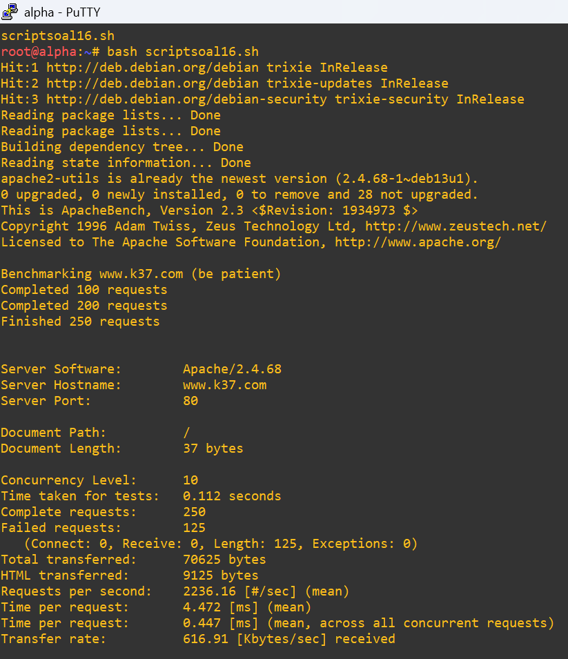
*(Tangkapan layar hasil benchmark ApacheBench pada www.k37.com)*

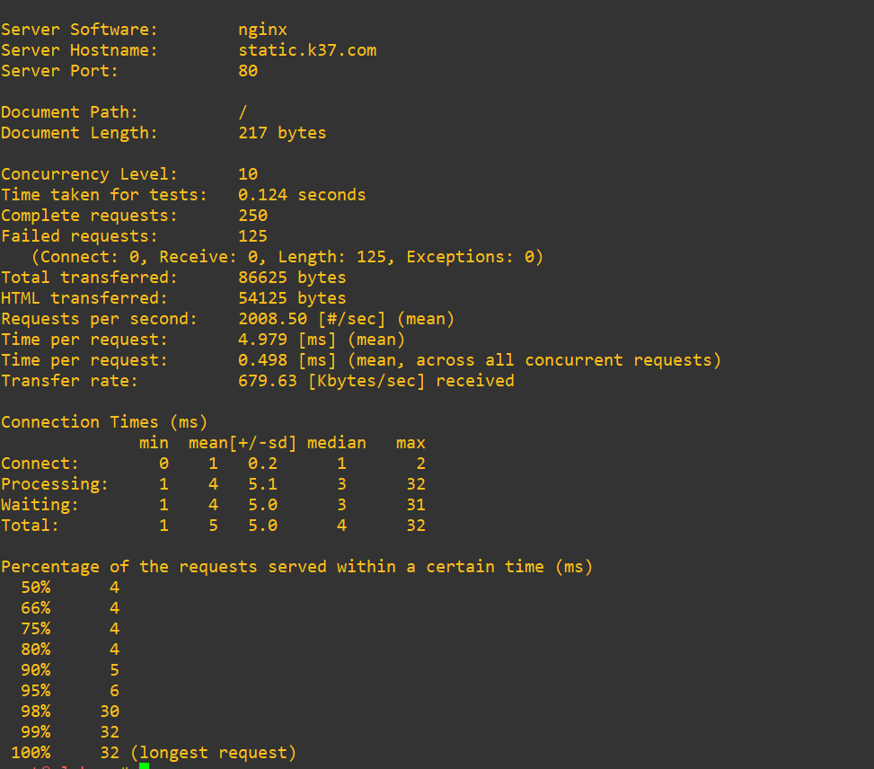
*(Tangkapan layar hasil benchmark ApacheBench pada static.k37.com)*

---


## soal 17 - Azfaro

---

Tambahkan TXT record pada DNS untuk semua klien sayap kiri dan sayap kanan (Alpha, Beta, Gamma, Delta, Epsilon). Jika DNS di-query TXT terhadap nama domain mereka (contoh: alpha.<xxxx>.com), sistem harus mengembalikan teks berupa nama hostname mereka masing-masing (contoh: "alpha").


Script konfigurasi dan pengujian disimpan di [`scripts/soal17.sh`](scripts/soal17.sh).

### 1. Konfigurasi pada Prab (Master DNS)

Tambahkan TXT record ke dalam file zone DNS `/var/cache/bind/db.k37.com`:
```bash
cat >> /var/cache/bind/db.k37.com <<'EOF'

; TXT record - Soal No. 17
alpha       IN TXT "alpha"
beta        IN TXT "beta"
gamma       IN TXT "gamma"
delta       IN TXT "delta"
epsilon     IN TXT "epsilon"
EOF
```

Naikkan serial SOA secara dinamis, validasi zone file, dan reload service BIND pada Prab:
```bash
SERIAL_OLD=$(grep -oE '[0-9]{10}' /var/cache/bind/db.k37.com | head -1)
[ -n "$SERIAL_OLD" ] && sed -i "s/$SERIAL_OLD/$((SERIAL_OLD + 1))/" /var/cache/bind/db.k37.com

named-checkzone k37.com /var/cache/bind/db.k37.com
service bind9 restart 2>/dev/null || service named restart 2>/dev/null || { pkill named; named -c /etc/bind/named.conf; }
```

Hasil validasi zone file:
```text
zone k37.com/IN: loaded serial 2026092904
OK
```

Hasil tersebut menunjukkan bahwa konfigurasi zone `k37.com` berhasil dimuat tanpa kesalahan sintaks.

3. Verifikasi TXT Record

Setelah konfigurasi DNS diaktifkan kembali, dilakukan pengujian menggunakan perintah dig terhadap DNS Master Prab:
```bash
dig @10.82.1.2 alpha.k37.com TXT +short
dig @10.82.1.2 beta.k37.com TXT +short
dig @10.82.1.2 gamma.k37.com TXT +short
dig @10.82.1.2 delta.k37.com TXT +short
dig @10.82.1.2 epsilon.k37.com TXT +short
```
Hasil yang diharapkan:
```bash
"alpha"
"beta"
"gamma"
"delta"
"epsilon"
```
Dengan demikian, setiap hostname klien memiliki TXT record yang mengembalikan teks sesuai dengan nama hostname masing-masing.
```bash
Hostname	TXT Record
alpha.k37.com	"alpha"
beta.k37.com	"beta"
gamma.k37.com	"gamma"
delta.k37.com	"delta"
epsilon.k37.com	"epsilon"
```

---

## soal 18 - Azfaro

Ubah A record DNS milik `abbey.xxx.com` (`abbey.k37.com`) ke alamat IP yang fiktif (ubah secara random namun pastikan format IP valid). Naikkan nilai serial SOA di prab dan pastikan tedd ikut tersinkron. Tetapkan TTL sebesar 15 detik pada record yang relevan tersebut. Verifikasi momen yang terjadi pada tiga fase pencarian: sebelum perubahan terjadi (mengembalikan IP lama), saat perubahan baru saja terjadi dalam jeda 15 detik (masih IP lama karena cache), dan setelah batas waktu TTL habis (berubah ke IP fiktif yang baru).

Script konfigurasi dan pengujian disimpan di [`scripts/soal18.sh`](scripts/soal18.sh).

### 1. Konfigurasi pada Prab (Master DNS)

File zone yang digunakan adalah `/var/cache/bind/db.k37.com`.

Sebelum dilakukan perubahan, isi zone file memiliki konfigurasi default dengan serial SOA awal dan A record `abbey` mengarah ke IP aslinya `10.82.4.2`:

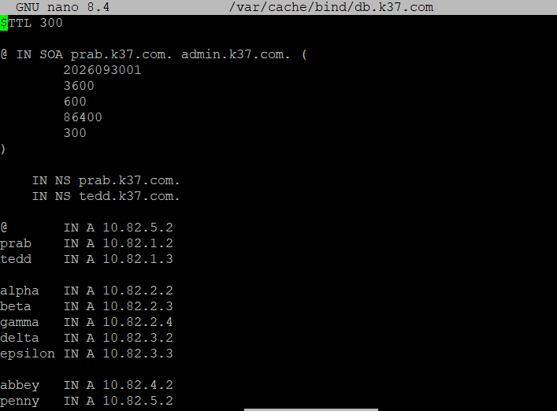
*(Tangkapan layar konfigurasi awal `/var/cache/bind/db.k37.com` dengan serial SOA awal dan IP abbey lama 10.82.4.2)*

Perubahan yang dilakukan pada Prab:
1. **Menaikkan Serial SOA**: Serial SOA dinaikkan (dari serial awal menjadi `2026092909` / `2026093008`) agar perubahan dikenali oleh DNS Slave (Tedd) dan memicu sinkronisasi zone transfer.
2. **Mengubah Record Abbey dengan TTL 15 Detik**: Nilai TTL disetel khusus sebesar 15 detik pada record `abbey`, dan alamat IP diubah ke IP fiktif valid, yaitu `10.82.4.50`:
   ```text
   abbey    15    IN    A    10.82.4.50
   ```

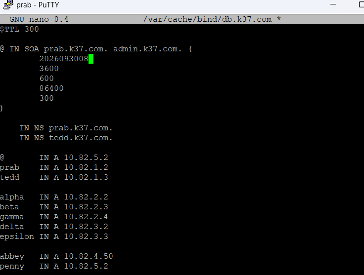
*(Tangkapan layar pengeditan `/var/cache/bind/db.k37.com` dengan kenaikan serial SOA dan IP fiktif 10.82.4.50)*

Setelah file zone diperbarui, sintaks zone file divalidasi menggunakan perintah:
```bash
named-checkzone k37.com /var/cache/bind/db.k37.com
```
Lalu reload layanan BIND pada Prab:
```bash
pkill named
named -c /etc/bind/named.conf
```

---

### 2. Sinkronisasi pada Tedd (Slave DNS)

Pada server DNS Slave (`tedd`, IP `10.82.1.3`), BIND secara otomatis menerima sinyal notifikasi perubahan dari Prab dan menarik data zone terbaru (*zone transfer*). Dilakukan verifikasi menggunakan `dig`:
```bash
dig @10.82.1.3 abbey.k37.com A +noall +answer
dig @10.82.1.3 k37.com SOA +noall +answer
```
Hasil verifikasi menunjukkan bahwa Tedd telah tersinkronisasi sepenuhnya:
- Record `abbey.k37.com.` memiliki TTL `15` detik dan mengarah ke IP baru `10.82.4.50`.
- Serial SOA pada domain `k37.com.` terupdate menjadi serial baru (`2026092909`).

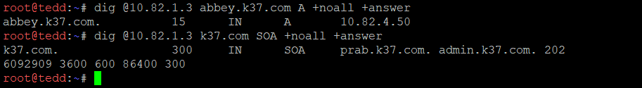
*(Tangkapan layar verifikasi sinkronisasi pada Slave Tedd dengan serial SOA baru dan record abbey ber-TTL 15 detik)*

---

### 3. Verifikasi Tiga Fase Pencarian (DNS Caching)

Untuk membuktikan mekanisme *caching* dan siklus hidup TTL (Time to Live) 15 detik, dilakukan pengamatan pada tiga fase resolusi DNS:

1. **Fase 1: Sebelum Perubahan Terjadi (Mengembalikan IP Lama)**
   Sebelum zone diperbarui/di-reload, query DNS terhadap `abbey.k37.com` mengembalikan IP lama server Abbey (`10.82.4.2`) dengan TTL standar zone (300 detik).
   ```bash
   dig @10.82.1.2 abbey.k37.com A +noall +answer
   ```
   *Output:*
   ```text
   abbey.k37.com.          300     IN      A       10.82.4.2
   ```
   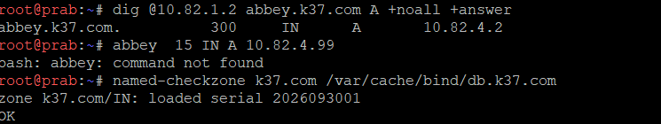
   *(Tangkapan layar Fase 1: Query awal mengembalikan alamat IP lama 10.82.4.2)*

2. **Fase 2: Saat Perubahan Baru Saja Terjadi dalam Jeda 15 Detik (Masih IP Lama karena Cache)**
   Ketika data record pada file zone telah diubah menjadi IP fiktif (`10.82.4.50`) dan serial SOA telah dinaikkan, query yang dilakukan dalam jeda waktu sebelum masa cache DNS lokal kedaluwarsa masih mengembalikan IP lama (`10.82.4.2`). Hal ini membuktikan bahwa resolver memanfaatkan entri cache yang masih valid dan belum melakukan permintaan ulang ke zone data yang baru.
   ```bash
   # Bukti file zone sudah berisi IP fiktif 10.82.4.50
   grep -n 'abbey' /var/cache/bind/db.k37.com
   # 23:abbey          IN      A       10.82.4.50

   # Query dig saat jeda waktu (masih menghasilkan IP lama dari cache)
   dig @10.82.1.2 abbey.k37.com A +noall +answer
   # abbey.k37.com.          300     IN      A       10.82.4.2
   ```
   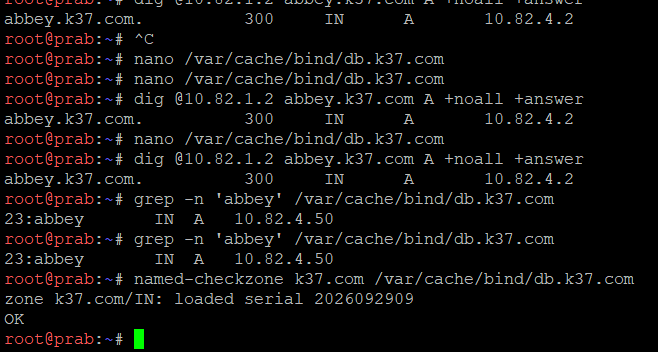
   *(Tangkapan layar Fase 2: File zone telah memuat IP baru, namun query dig sesaat setelahnya masih merespons dengan IP lama 10.82.4.2 akibat cache)*

3. **Fase 3: Setelah Batas Waktu TTL Habis (Berubah ke IP Fiktif yang Baru)**
   Setelah batas waktu TTL (15 detik) berakhir, cache pada resolver kedaluwarsa (*expired*). Query berikutnya memaksa nameserver memberikan data autoritatif terbaru. Hasil resolusi DNS secara otomatis beralih menampilkan alamat IP fiktif yang baru (`10.82.4.50`) dengan nilai TTL 15 detik, baik pada Master DNS (`prab`) maupun Slave DNS (`tedd`).
   ```bash
   # Setelah jeda TTL (15 detik)
   dig @10.82.1.3 abbey.k37.com A +noall +answer
   # abbey.k37.com.           15     IN      A       10.82.4.50
   ```

---

## soal 19 - Azfaro

Buat CNAME record yang melakukan binding dari domain internal `outbound.xxx.com` (`outbound.k37.com`) menuju domain eksternal `http.badssl.com`. Lakukan perintah curl ke `http://outbound.xxx.com` dan pastikan output yang dihasilkan sesuai dengan isi konten di halaman `http.badssl.com`.

Script konfigurasi dan pengujian disimpan di [`scripts/soal19.sh`](scripts/soal19.sh).

### 1. Konfigurasi DNS Options (Forwarders & Rekursi)

Agar server DNS BIND dapat menyelesaikan nama domain eksternal (`http.badssl.com`) yang direferensikan oleh CNAME, opsi `recursion`, `forwarders`, serta `allow-query` harus aktif pada file `/etc/bind/named.conf.options`:
```bash
cat <<EOF > /etc/bind/named.conf.options
options {
    directory "/var/cache/bind";

    forwarders {
        192.168.122.1;
    };

    allow-query { any; };
    allow-recursion { any; };
    recursion yes;
};
EOF
```
Konfigurasi ini memungkinkan Prab meneruskan (*forward*) pencarian rekursif untuk domain publik di luar zone lokal ke gateway/upstream DNS.

---

### 2. Penambahan CNAME Record pada Prab (Master DNS)

Pada file zone `/var/cache/bind/db.k37.com`, ditambahkan record CNAME yang memetakan subdomain internal `outbound` ke domain publik eksternal `http.badssl.com.`:
```bash
cat >> /var/cache/bind/db.k37.com <<'EOF'
outbound    IN    CNAME    http.badssl.com.
EOF

# Naikkan serial SOA secara dinamis
SERIAL_OLD=$(grep -oE '[0-9]{10}' /var/cache/bind/db.k37.com | head -1)
[ -n "$SERIAL_OLD" ] && sed -i "s/$SERIAL_OLD/$((SERIAL_OLD + 1))/" /var/cache/bind/db.k37.com

# Validasi konfigurasi zone
named-checkconf /etc/bind/named.conf
named-checkzone k37.com /var/cache/bind/db.k37.com

# Reload service BIND
service bind9 restart 2>/dev/null || service named restart 2>/dev/null || { pkill named; named -c /etc/bind/named.conf; }
```

---

### 3. Pengujian dan Verifikasi

1. **Verifikasi Record CNAME:**
   Dilakukan pengecekan resolusi CNAME pada server Prab menggunakan perintah `dig`:
   ```bash
   dig @10.82.1.2 outbound.k37.com CNAME +noall +answer
   ```
   Hasil yang diperoleh:
   ```text
   outbound.k37.com.       300     IN      CNAME   http.badssl.com.
   ```
   Hal ini membuktikan bahwa binding dari domain internal `outbound.k37.com` ke domain eksternal `http.badssl.com` telah berhasil.

   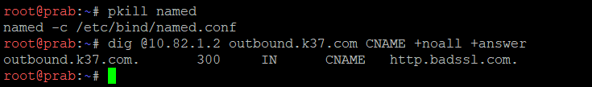
   *(Tangkapan layar restart service BIND dan verifikasi query CNAME outbound.k37.com mengarah ke http.badssl.com.)*

2. **Verifikasi Konten Web menggunakan `curl`:**
   Dilakukan perintah HTTP request menggunakan `curl` ke domain internal:
   ```bash
   curl http://outbound.k37.com
   ```
   Respons yang diterima adalah struktur HTML lengkap dari situs `http.badssl.com`:
   ```html
   <!DOCTYPE html>
   <html>
   <head>
   <title>Welcome to nginx!</title>
   <style>
       body {
           width: 35em;
           margin: 0 auto;
           font-family: Tahoma, Verdana, Arial, sans-serif;
       }
   </style>
   </head>
   <body>
   <h1>Welcome to nginx!</h1>
   <p>If you see this page, the nginx web server is successfully installed and
   working. Further configuration is required.</p>

   <p>For online documentation and support please refer to
   <a href="http://nginx.org/">nginx.org</a>.<br/>
   Commercial support is available at
   <a href="http://nginx.com/">nginx.com</a>.</p>

   <p><em>Thank you for using nginx.</em></p>
   </body>
   </html>
   ```
   Hasil output tersebut identik dengan halaman `http://http.badssl.com/`, membuktikan bahwa domain internal `outbound.k37.com` berhasil me-resolve dan mengakses web server eksternal tersebut secara transparan.

   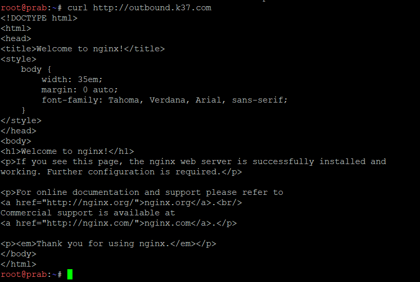
   *(Tangkapan layar hasil curl http://outbound.k37.com yang menampilkan konten halaman http.badssl.com)*

---

## soal 20 - Satya & Azfaro

---

Diminta untuk memastikan bahwa seluruh *service* dan konfigurasi yang telah dikerjakan dari awal praktikum tetap berjalan normal dan berstatus *autostart* saat node di-restart. Khusus pada nomor ini, konfigurasi IP fiktif pada nomor 18 diabaikan dan koordinat A record dikembalikan normal ke aslinya.

Script konfigurasi disimpan di [`scripts/soal20.sh`](scripts/soal20.sh).

### 1. Pengembalian Koordinat Normal pada DNS Master (Prab)
Pada node **prab**, record IP milik `abbey` dikembalikan ke IP aslinya (`10.82.4.2`), nilai serial SOA dinaikkan, dan service BIND9 di-reload:
```bash
sed -i 's/^abbey.*/abbey       IN  A   10.82.4.2/' /var/cache/bind/db.k37.com

SERIAL_OLD=$(grep -oE '[0-9]{10}' /var/cache/bind/db.k37.com | head -1)
[ -n "$SERIAL_OLD" ] && sed -i "s/$SERIAL_OLD/$((SERIAL_OLD + 1))/" /var/cache/bind/db.k37.com

named-checkzone k37.com /var/cache/bind/db.k37.com
service bind9 restart 2>/dev/null || service named restart 2>/dev/null || { pkill named; named -c /etc/bind/named.conf; }
```

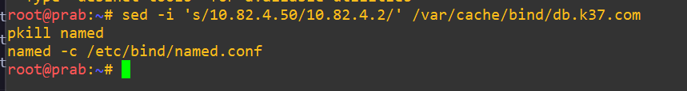
*(Tangkapan layar pengembalian A record abbey ke 10.82.4.2 pada node Prab)*

### 2. Konfigurasi Autostart Service pada Setiap Node
Perintah inisialisasi dimasukkan ke file `/root/.bashrc` pada masing-masing node agar otomatis aktif saat node/container di-restart:

1. **Rootkit (Router & NAT Gateway):**
   ```bash
   echo "ip addr add 192.168.122.50/24 dev eth0 2>/dev/null || true" >> /root/.bashrc
   echo "ip route add default via 192.168.122.1 2>/dev/null || true" >> /root/.bashrc
   echo "ip addr add 10.82.1.1/24 dev eth1 2>/dev/null || true; ip link set eth1 up" >> /root/.bashrc
   echo "ip addr add 10.82.2.1/24 dev eth2 2>/dev/null || true; ip link set eth2 up" >> /root/.bashrc
   echo "ip addr add 10.82.3.1/24 dev eth3 2>/dev/null || true; ip link set eth3 up" >> /root/.bashrc
   echo "ip addr add 10.82.4.1/24 dev eth4 2>/dev/null || true; ip link set eth4 up" >> /root/.bashrc
   echo "ip addr add 10.82.5.1/24 dev eth5 2>/dev/null || true; ip link set eth5 up" >> /root/.bashrc
   echo "sysctl -w net.ipv4.ip_forward=1" >> /root/.bashrc
   echo "iptables -t nat -A POSTROUTING -o eth0 -j MASQUERADE" >> /root/.bashrc
   ```
2. **Prab & Tedd (DNS Master & Slave):**
   ```bash
   echo "service bind9 start 2>/dev/null || service named start 2>/dev/null || named -c /etc/bind/named.conf" >> /root/.bashrc
   ```
3. **Penny (Reverse Proxy Apache & PHP-FPM):**
   ```bash
   echo "service php8.4-fpm start 2>/dev/null || service php-fpm start 2>/dev/null" >> /root/.bashrc
   echo "service apache2 start" >> /root/.bashrc
   ```
4. **Abbey (Reverse Proxy Nginx):**
   ```bash
   echo "service nginx start" >> /root/.bashrc
   ```
5. **Obladi & Desmond (Cluster Apache Vault):**
   ```bash
   echo "service apache2 start" >> /root/.bashrc
   ```
6. **Oblada & Molly (Cluster Nginx & PHP-FPM Core):**
   ```bash
   echo "service php8.4-fpm start 2>/dev/null || service php-fpm start 2>/dev/null" >> /root/.bashrc
   echo "service nginx start" >> /root/.bashrc
   ```
7. **Client Nodes (Alpha, Beta, Gamma, Delta, Epsilon):**
   ```bash
   cat <<'EOF' >> /root/.bashrc
   cat > /etc/resolv.conf <<'CONF'
   nameserver 10.82.1.2
   nameserver 10.82.1.3
   nameserver 192.168.122.1
   CONF
   EOF
   ```

### 3. Pengujian dan Verifikasi Pasca-Restart
Setelah seluruh node di-restart melalui GNS3, pengujian menyeluruh dilakukan langsung dari node Klien (**alpha** atau **gamma**) tanpa menyalakan service manual apa pun:

```bash
# 1. Verifikasi DNS: Pastikan IP abbey telah normal kembali ke 10.82.4.2
dig @10.82.1.2 abbey.k37.com +short

# 2. Verifikasi Reverse Proxy Penny & Cluster Vault (HTTP 200 OK)
curl -I http://www.k37.com/

# 3. Verifikasi Reverse Proxy Abbey & Cluster Core (HTTP 200 OK)
curl -I http://static.k37.com/profil

# 4. Verifikasi Dedicated Path Penny (/eternal dinamis PHP)
curl -s http://www.k37.com/eternal/

# 5. Verifikasi Dedicated Path Abbey (/orion murni statis)
curl -s http://static.k37.com/orion/
```

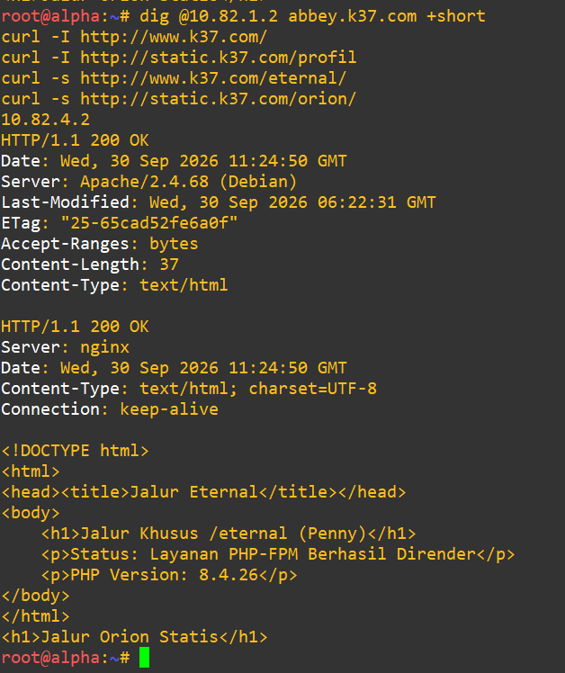
*(Tangkapan layar pengujian pasca-restart: seluruh service DNS, Reverse Proxy, dan Web Server backend langsung berjalan normal secara otomatis)*
